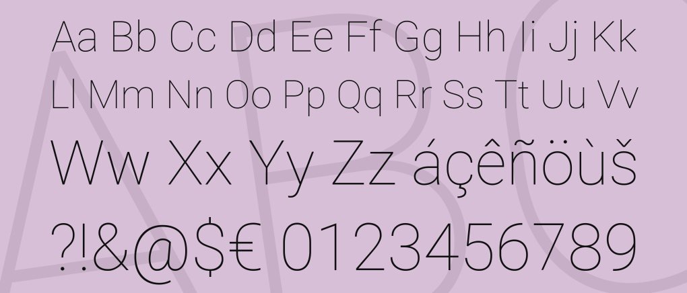

# Sagittarius A-Star: A Supermassive Bookstore

Welcome to 'Sagittarius A-Star', an astronomy-focused online bookstore, where the wonders of the universe are just a click away!

Named after the supermassive black hole at the center of our galaxy, our online bookstore is dedicated to bringing the vast and fascinating world of astronomy to your fingertips. Whether you're a seasoned astronomer, a curious beginner, or even a young aspiring stargazer, you'll find a diverse collection of astronomy books tailored to your interests.

Our carefully prepared selection of books consists of 10 categories:
- Astronomy Charts,
- Astronomy for Children, 
- Astrophotography,
- Astrophysics,
- Popular Astronomy,
- Space Exploration,
- Stargazing,
- Stars & Interstellar Matter,
- Telescopes & Equipment,
- Theoretical Astronomy.

## Rationale for creating the website

The inspiration behind 'Sagittarius A-Star: A Supermassive Bookstore' comes from my deep passion for astronomy and a desire to share this enthusiasm with a broader audience. As an astronomy enthusiast, I have always been captivated by the wonders of the universe, and I wanted to create a platform that brings this awe-inspiring knowledge to both seasoned astronomers and curious newcomers. The bookstore serves as a dedicated space where individuals of all ages can explore a diverse range of astronomy books, carefully selected to cater to various interests within the field. By offering a user-friendly, beautifully designed website with features such as personalized accounts, order history, newsletter subscription and a comprehensive selection of books, my goal is to make the vastness of the cosmos accessible and engaging. Ultimately, 'Sagittarius A-Star' aims to inspire curiosity, foster a deeper understanding of the universe, and provide a convenient way for people to embark on their own astronomical journeys from the comfort of their homes.

## User Stories

To assist with the development of this project, I created user stories that clearly define the needs and expectations of the users, ensuring the process stays user-centered. By outlining specific scenarios and desired outcomes, these stories help guide the design and functionality of the website, making it more intuitive and effective in meeting user demands. I further divided these user stories into epics to adopt an agile approach to my web development process.

EPIC 1: General Site Functionality

- As a first-time user, I would like to find clear information about the site's purpose to decide if it aligns with my interests and if I wish to explore it further. (MUST HAVE)
- As a site user, I want to interact with a visually appealing, intuitive, responsive website that is easy to navigate across different devices, helping me quickly find desired content. (MUST HAVE)
- As a site user, I want to access a search functionality to quickly locate specific products and check their availability. (SHOULD HAVE)
- As a site user, I would appreciate having the option to contact site owners for additional information or to file a complaint. (SHOULD HAVE)

EPIC 2: Product Browsing and Searching

- As a site user, I want to see a full list of products allowing me to browse and explore the complete selection of available items.  (MUST HAVE)
- As a site user, I want to view the price of a product to assess its affordability and decide whether it fits my budget before purchasing. (MUST HAVE)
- As a site user, I can access individual product pages to explore additional details such as product description. (MUST HAVE)
- As a site user, I want to access a sorting functionality that allows me to organize results by criteria such as price, publication date, and customer ratings to narrow down my choices effectively. (SHOULD HAVE)
- As a site user, I expect a seamless transition from browsing to purchasing books, with clear calls-to-action and a user-friendly checkout process. (MUST HAVE)
- As a site user, I prefer to see real-time availability status (e.g., in stock, out of stock) of books to make informed purchase decisions. (WON'T HAVE)
- As a registered user, I would like the option to add books to a wishlist or save them for later purchase, making it easy to track and manage items of interest. (WON'T HAVE)
- As a registered user, I would like the ability to review products I've purchased to share my experience with other potential customers. (WON'T HAVE)

EPIC 3 -SHOPPING AND CHECKOUT PROCESS

- As a site user, I can add products to my shopping bag, where they will be stored until I am ready to purchase them. (MUST HAVE)
- As a site user, I can modify the quantity of items in my shopping bag, making it easy to increase or decrease quantities based on my preferences. (MUST HAVE)
- As a site user, I can delete items from my shopping bag to refine my selections and ensure my final purchase includes only the items I intend to buy. (MUST HAVE)
- As a site user, I can see the chosen items in my shopping bag to review my selections, check quantities, and verify prices before proceeding to checkout. (MUST HAVE)
- As a site user, I can securely and efficiently complete my purchase transaction using card payment, providing payment and shipping information to finalize my order and receive selected products. (MUST HAVE)
- As a site user, I receive an email confirming my order after purchase, allowing me to review the purchase details and confirm that my order was successfully processed. (MUST HAVE)
- As a registered user, I have access to my order history to review past purchases, track order statuses, and keep a record of transactions for future reference. (COULD HAVE)

EPIC 4 - USER ACCOUNT MANAGEMENT

- As a site user, I want to create an account to store my shipping details for the future transactions. (MUST HAVE)
- As a registered user, I want to access my order history to review my past purchases and find items I have previously bought. (MUST HAVE)
- As a registered user, I want the ability to update my personal information to ensure it is current and accurate. (MUST HAVE)
- As a registered user, I would like to add products to my wishlist to keep track of items I am interested in purchasing in the future. (WON'T HAVE)
- As a registered user, I would like to be able to leave reviews for products I have purchased in the past, sharing my insights with other users. (WON'T HAVE)

EPIC 5 - PRODUCT ADMINISTRATION

- As a site administrator, I can add new products to the store to expand the range of available items and ensure the product catalog is consistently refreshed. (MUST HAVE)
- As a site administrator, I can edit the details of individual products to guarantee that product information remains current and correct. (MUST HAVE)
- As a site administrator, I can delete products from the store to efficiently manage inventory, eliminating items that are discontinued or no longer in demand. (MUST HAVE)
- As a site administrator, I have the ability to set and adjust stock levels for each product, ensuring precise inventory control to prevent overselling or stockouts, and to maintain accurate product availability information for users. (COULD HAVE)

EPIC 6 - MARKETING AND DIGITAL PRESENCE

- As a site user, I want to be able to subscribe to the site's newsletter to receive offers and updates via email. (COULD HAVE)
- As a site admin, I need to set relevant keywords on site pages to enhance visibility and improve search engine ranking, making it easier for potential customers to find the site on Google. (MUST HAVE)
- As a site admin, I want to display my business's social media accounts on the site to encourage users to engage more deeply with the brand. (MUST HAVE)
-  As a site admin, I want to implement customer retention strategies (such as loyalty programs, and exclusive offers) to enhance customer satisfaction and encourage repeat purchases. (WON'T HAVE)
- As a site admin, I want to create referral programs that encourage current customers to refer new customers, using word-of-mouth marketing to grow our customer community. (WON'T HAVE)

## Design

### Colour Scheme

The colour scheme of "Sagittarius A-Star: A Supermassive Book Store" was generated from its background image, which captures the beauty of the universe. Because it plays a crucial role in setting the tone and atmosphere of the store, I wanted to keep it close to the astronomical theme by introducing the classic combination of black, silver and white, alongside two very different shades of the night sky: a subtle glaucous (a slightly desaturated blue) and an intense midnight green (a dark shade of cyan). The contrasting colour accent on the site is a mid-toned, golden grass shade called lion, which - as its name suggests - is a representation of the average colour of a lion's fur. I believe that, by being commonly associated with old book pages, it nicely breaks the cosmic convention here and adds a touch of warmth and balance.

I used [Image Colour Picker](https://imagecolorpicker.com/) to find the best shades in my home page background image, and [Coolors](https://coolors.co/000000-adadad-fafafa-ad9064-5e7ea8-194d60) to generate my colour palette.

### Typography

To find the right combination of well-matching fonts, I used one of the font pairing services, [fontpair.co](https://www.fontpair.co/). My first choice was a very popular and widely used sans-serif font called [Roboto](https://fonts.google.com/specimen/Roboto?query=roboto), designed by Google for Android devices. It's a classic and elegant typeface that ensures easy readability. Planning to use it for the main text content, such as product descriptions and form input fields, I needed another font for titles, subheadings, and form labels to complement it harmoniously. To my surprise, the match I liked the most was Roboto & Roboto — the simplest solution I could imagine but somehow never thought of.

For the website's main logo, navbar, main headings, and footer, I used another sans-serif font called [Orbitron](https://fonts.google.com/specimen/Orbitron?query=orbitron). I believe its modern and futuristic design added the scientific vibe I so desperately wanted to create.

I used [Google Fonts](https://fonts.google.com/) to import the fonts that style all of the text content, and [Font Awesome](https://fontawesome.com/) to provide icons across the website.