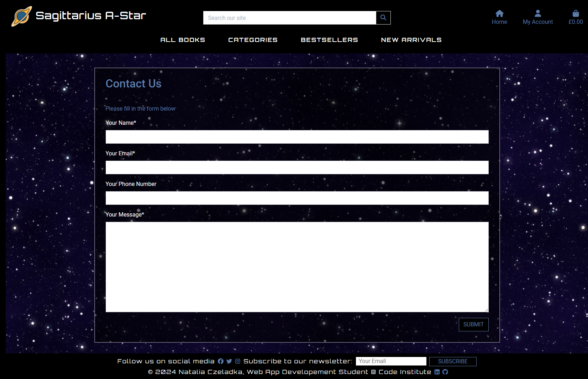
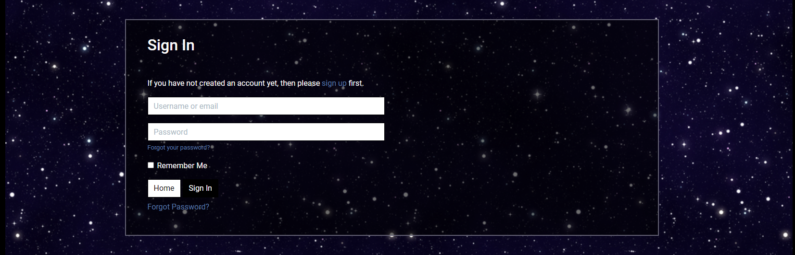

# Sagittarius A-Star: A Supermassive Bookstore

[](https://github.com/NataliaCzeladka/sagittarius-a-star/commits/main)
[](https://github.com/NataliaCzeladka/sagittarius-a-star)

Welcome to 'Sagittarius A-Star', an astronomy-focused online bookstore, where the wonders of the universe are just a click away! Don't hesitate to visit our [website](https://sagittarius-a-star-ab236042b163.herokuapp.com/)!


Named after the supermassive black hole at the center of our galaxy, our online bookstore is dedicated to bringing the vast and fascinating world of astronomy to your fingertips. Whether you're a seasoned astronomer, a curious beginner, or even a young aspiring stargazer, you'll find a diverse collection of astronomy books tailored to your interests.

Our carefully prepared selection of books consists of 10 categories:
- Astronomy Charts,
- Astronomy for Children, 
- Astrophotography,
- Astrophysics,
- Popular Astronomy,
- Space Exploration,
- Stargazing,
- Stars & Interstellar Matter,
- Telescopes & Equipment,
- Theoretical Astronomy.


## Rationale for creating the website

The inspiration behind 'Sagittarius A-Star: A Supermassive Bookstore' comes from my deep passion for astronomy and a desire to share this enthusiasm with a broader audience. As an astronomy enthusiast, I have always been captivated by the wonders of the universe, and I wanted to create a platform that brings this awe-inspiring knowledge to both seasoned astronomers and curious newcomers. The bookstore serves as a dedicated space where individuals of all ages can explore a diverse range of astronomy books, carefully selected to cater to various interests within the field. By offering a user-friendly, beautifully designed website with features such as personalized accounts, order history, newsletter subscription and a comprehensive selection of books, my goal is to make the vastness of the cosmos accessible and engaging. Ultimately, 'Sagittarius A-Star' aims to inspire curiosity, foster a deeper understanding of the universe, and provide a convenient way for people to embark on their own astronomical journeys from the comfort of their homes.

## User Stories

To assist with the development of this project, I created user stories that clearly define the needs and expectations of the users, ensuring the process stays user-centered. By outlining specific scenarios and desired outcomes, these stories help guide the design and functionality of the website, making it more intuitive and effective in meeting user demands. I further divided these user stories into epics to adopt an agile approach to my web development process.

EPIC 1: General Site Functionality

- As a first-time user, I would like to find clear information about the site's purpose to decide if it aligns with my interests and if I wish to explore it further. (MUST HAVE)
- As a site user, I want to interact with a visually appealing, intuitive, responsive website that is easy to navigate across different devices, helping me quickly find desired content. (MUST HAVE)
- As a site user, I want to access a search functionality to quickly locate specific products. (SHOULD HAVE)
- As a site user, I would appreciate having the option to contact site owners for additional information or to file a complaint. (SHOULD HAVE)

EPIC 2: Product Browsing and Searching

- As a site user, I want to see a full list of products allowing me to browse and explore the complete selection of available items.  (MUST HAVE)
- As a site user, I want to view the price of a product to assess its affordability and decide whether it fits my budget before purchasing. (MUST HAVE)
- As a site user, I can access individual product pages to explore additional details such as product description. (MUST HAVE)
- As a site user, I want to access a sorting functionality that allows me to organize results by criteria such as price, publication date, and customer ratings to narrow down my choices effectively. (SHOULD HAVE)
- As a site user, I expect a seamless transition from browsing to purchasing books, with clear calls-to-action and a user-friendly checkout process. (MUST HAVE)
- As a site user, I prefer to see real-time availability status (e.g., in stock, out of stock) of books to make informed purchase decisions. (WON'T HAVE)
- As a registered user, I would like the option to add books to a wishlist or save them for later purchase, making it easy to track and manage items of interest. (WON'T HAVE)
- As a registered user, I would like the ability to review products I've purchased to share my experience with other potential customers. (WON'T HAVE)

EPIC 3 SHOPPING AND CHECKOUT PROCESS

- As a site user, I can add products to my shopping bag, where they will be stored until I am ready to purchase them. (MUST HAVE)
- As a site user, I can modify the quantity of items in my shopping bag, making it easy to increase or decrease quantities based on my preferences. (MUST HAVE)
- As a site user, I can delete items from my shopping bag to refine my selections and ensure my final purchase includes only the items I intend to buy. (MUST HAVE)
- As a site user, I can see the chosen items in my shopping bag to review my selections, check quantities, and verify prices before proceeding to checkout. (MUST HAVE)
- As a site user, I can securely and efficiently complete my purchase transaction using card payment, providing payment and shipping information to finalize my order and receive selected products. (MUST HAVE)
- As a site user, I receive an email confirming my order after purchase, allowing me to review the purchase details and confirm that my order was successfully processed. (MUST HAVE)
- As a registered user, I have access to my order history to review past purchases, track order statuses, and keep a record of transactions for future reference. (COULD HAVE)

EPIC 4 - USER ACCOUNT MANAGEMENT

- As a site user, I want to create an account to store my shipping details for the future transactions. (MUST HAVE)
- As a registered user, I want to access my order history to review my past purchases and find items I have previously bought. (MUST HAVE)
- As a registered user, I want the ability to update my personal information to ensure it is current and accurate. (MUST HAVE)
- As a registered user, I would like to add products to my wishlist to keep track of items I am interested in purchasing in the future. (WON'T HAVE)
- As a registered user, I would like to be able to leave reviews for products I have purchased in the past, sharing my insights with other users. (WON'T HAVE)

EPIC 5 - PRODUCT ADMINISTRATION

- As a site administrator, I can add new products to the store to expand the range of available items and ensure the product catalog is consistently refreshed. (MUST HAVE)
- As a site administrator, I can edit the details of individual products to guarantee that product information remains current and correct. (MUST HAVE)
- As a site administrator, I can delete products from the store to efficiently manage inventory, eliminating items that are discontinued or no longer in demand. (MUST HAVE)
- As a site administrator, I have the ability to set and adjust stock levels for each product, ensuring precise inventory control to prevent overselling or stockouts, and to maintain accurate product availability information for users. (COULD HAVE)

EPIC 6 - MARKETING AND DIGITAL PRESENCE

- As a site user, I want to be able to subscribe to the site's newsletter to receive offers and updates via email. (COULD HAVE)
- As a site admin, I need to set relevant keywords on site pages to enhance visibility and improve search engine ranking, making it easier for potential customers to find the site on Google. (MUST HAVE)
- As a site admin, I want to display my business's social media accounts on the site to encourage users to engage more deeply with the brand. (MUST HAVE)
-  As a site admin, I want to implement customer retention strategies (such as loyalty programs, and exclusive offers) to enhance customer satisfaction and encourage repeat purchases. (WON'T HAVE)
- As a site admin, I want to create referral programs that encourage current customers to refer new customers, using word-of-mouth marketing to grow our customer community. (WON'T HAVE)

## Design

### Colour Scheme

The colour scheme of "Sagittarius A-Star: A Supermassive Book Store" was generated from its background image, which captures the beauty of the universe. Because it plays a crucial role in setting the tone and atmosphere of the store, I wanted to keep it close to the astronomical theme by introducing the classic combination of black, silver and white, alongside two very different shades of the night sky: a subtle glaucous (a slightly desaturated blue) and an intense midnight green (a dark shade of cyan). The contrasting colour accent on the site is a mid-toned, golden grass shade called lion, which - as its name suggests - is a representation of the average colour of a lion's fur. I believe that, by being commonly associated with old book pages, it nicely breaks the cosmic convention here and adds a touch of warmth and balance.

I used [Image Colour Picker](https://imagecolorpicker.com/) to find the best shades in my home page background image, and [Coolors](https://coolors.co/000000-adadad-fafafa-ad9064-5e7ea8-194d60) to generate my colour palette.


### Typography

To find the right combination of well-matching fonts, I used one of the font pairing services, [fontpair.co](https://www.fontpair.co/). My first choice was a very popular and widely used sans-serif font called [Roboto](https://fonts.google.com/specimen/Roboto?query=roboto), designed by Google for Android devices. It's a classic and elegant typeface that ensures easy readability. Planning to use it for the main text content, such as product descriptions and form input fields, I needed another font for titles, subheadings, and form labels to complement it harmoniously. To my surprise, the match I liked the most was Roboto & Roboto — the simplest solution I could imagine but somehow never thought of.


For the website's main logo, navbar, main headings, and footer, I used another sans-serif font called [Orbitron](https://fonts.google.com/specimen/Orbitron?query=orbitron). I believe its modern and futuristic design added the scientific vibe I so desperately wanted to create.


I used [Google Fonts](https://fonts.google.com/) to import the fonts that style all of the text content, and [Font Awesome](https://fontawesome.com/) to provide icons across the website.

### Imagery

Images play a crucial role in enhancing the overall user experience, making the content more engaging. However, the website currently features only two: the main homepage picture and the overlay picture used for all other pages. This limitation stems from the fact that each listing will include a featured image uploaded by the shop owner when adding new products to the store. Additionally, there is a logo placed in the top left corner of every page, which is also used as a favicon. The images were sourced from [Shutterstock](https://www.shutterstock.com/), [Midjourney](https://www.midjourney.com/home), and [Flaticon](https://www.flaticon.com/) (details in the 'Credits' section). All book cover images came from [Amazon](https://www.amazon.co.uk/) listings.

### Wireframes

| Size | Screenshot |
| --- | --- |
| Desktop |  |
| Tablet |  |

### Features

The 'Sagittarius A-Star' is a comprehensive platform designed to serve the needs of astronomy enthusiasts of all levels. From the organized homepage to the detailed product pages, the website offers a seamless and engaging user experience. Below is a detailed overview of the features available across the entire website:

#### Header and Navigation Menu


The header is structured to provide easy access to essential site functionalities and information. It includes:
- Logo and Branding: The top-left corner features the bookstore's logo and name, 'Sagittarius A-Star,' which also serves as a link to the homepage.
- Search Bar: Centrally positioned, the search bar allows users to quickly search for books or other content within the site.
- Navigation Links: The top-right corner includes links to the homepage, account management options (sign up, sign in, sign out, user profile, and admin only - product management), and a shopping bag icon displaying the current cart total. 
- Navigation Menu: Designed to help users explore the site's content efficiently. It consists of dropdown menu that lets users sort books by price, rating, year, or view all available books at once. It also has category dropdown menu that group books into various topics such as Astronomy Charts, Astrophotography, Space Exploration, and more, helping users find books related to their specific interests. And finally, Bestsellers and New Arrivals tabs serve as quick links to view the most popular and the newest additions to the bookstore's collection.


Mobile and tablet header designs are slightly different to fit all the features into smaller screens. The responsive design allows some elements to collapse into links or a hamburger menu.

| Mobile Header 1 | Mobile Header 2 | Mobile Header 3 |
| --- | --- | --- |
|  |  |  |

#### Footer

The footer enhances user interaction and provides additional information:

- Social Media Links: Icons with links to the bookstore's Facebook, Twitter, and Instagram pages encourage users to connect on social media.
- Newsletter Subscription: Users can subscribe to the newsletter by entering their email, allowing them to stay updated with the latest news and offerings.
- Contact and Legal Information: The footer also includes a copyright notice and links to the developer's LinkedIn and GitHub profiles.


Overall, the homepage of Sagittarius A-Star is designed to be user-friendly and visually appealing, with a focus on helping users find and explore their interests in astronomy through a well-organized and accessible interface.

#### Home Page Main Content

The main content area provides an engaging introduction to the bookstore:
- Promotional Text: The homepage features a prominent headline, "A Supermassive Book Store," and a subheadline encouraging users to "Explore the cosmos from the comfort of your home."
- Call-to-Action Buttons: Two primary buttons, "Shop Now" and "Contact Us," are displayed to direct users to start shopping or get in touch with the store for inquiries.


#### Features of the Products Page

The Products Page is designed to provide an optimal browsing experience for users looking to explore our extensive collection of books. Here’s a detailed overview of its features:

- Category Display: The page dynamically displays the current category being viewed, such as "Bestsellers," "Space Exploration," or specific sorting criteria like "Books by Price" or "Books by Rating."
- Sorting Selector: Users can sort the books by various criteria including price (low to high, high to low), rating, and year of publication. The selected sorting option updates the page content in real-time.
- Pagination Controls: The page includes pagination controls to navigate through the extensive collection. Users can easily move to the first, previous, next, or last page.
- Books Count: A counter shows the total number of books available based on the current filters, providing users with a clear idea of the collection size.
- Book Listings: Each book is displayed in a card format that includes: an image (a thumbnail image of the book cover), the book title along with the publication year, price, category, and rating. For administrative users, each book card includes options to edit or delete the book (visible only to admin).
- Back to Top Button: A "Back to Top" button is available for easy navigation to the top of the page.


#### Features of the Product Detail Page

The Product Details Page is designed to offer users a comprehensive view of individual books, ensuring they have all the information needed to make informed purchasing decisions. Here’s a detailed overview of its features:

- Book Image: A high-quality image of the book cover is prominently displayed. Users can click on the image to view a larger version in a new tab. If no image is available, a placeholder image is shown.
- Book Information: Detailed information about the book is provided, including the title, author, publication year, and cover type. This information is presented in an easy-to-read format.
- Price Display: The price of the book is shown in a bold and prominent font, ensuring it is easily noticeable.
- Category Link: If the book belongs to a specific category, a link is provided to view other books in the same category. This link is styled to stand out and includes a category icon.
- Rating Display: The book’s rating is displayed with a star icon. If the book has not been rated, a "No Rating" message is shown.
- Admin Controls: For administrative users, options to edit or delete the book are available. These controls are displayed subtly to avoid cluttering the page for regular users.
- Description: A detailed description of the book is provided, offering potential buyers an overview of the content and themes of the book.
- Quantity Selector: Users can choose the quantity of the book they wish to purchase. The quantity selector includes buttons to increment or decrement the quantity, with a maximum limit to ensure availability.
- Add to Bag Button: A prominent "Add to Bag" button allows users to add the book to their shopping cart. This button is styled to stand out and includes clear labeling.
- Keep Shopping Button: A "Keep Shopping" button is available, allowing users to return to the main product listing page without losing their place.


#### Features of the Add Product Page

The "Add Product" page provides a streamlined interface for administrators to add new products to the store efficiently. It incorporates validation, user-friendly labels, and intuitive navigation elements to enhance usability. By leveraging Django's capabilities and integrating JavaScript for image handling, the page ensures a seamless experience for managing product additions in the online store. Here's a detailed description of the "Add Product" page, including its features and functionality:

- Form for Adding a Product: A form is presented where administrators can input details for a new product. This form utilizes Django's form handling capabilities and includes the following fields:

	- Basic Fields: Title, author, description, price, category, cover type.
	- Optional Fields: New arrival and bestseller checkboxes allow marking special statuses.
	- Image Upload: Administrators can upload an image of the product using the file upload input.
	- Custom Labels: Special labels are provided for certain fields ('Is it a new arrival?' and 'Is it a bestseller?') to enhance user understanding and clarity in form fields.
	- Cancel and Submit Buttons: Clear buttons are available for navigation and actions:
		- Cancel Button: Redirects administrators back to the main product listing page.
		- Add Product Button: Submits the form data for processing and saving the new product into the database.

- Form Validation: Form validation ensures that all required fields are filled out correctly. Error messages are displayed to guide administrators in correcting any mistakes.
- Permissions: Access to the page is restricted to superusers only. Non-authorized users attempting to access this page are redirected to the homepage with an appropriate error message.
- Image Upload Preview: JavaScript code enhances user experience by allowing administrators to preview the selected product image before submission. When an image file is selected, the file name is displayed to confirm the selection.


#### Features of the Edit Product Page

The Edit Product page in this Django application closely resembles the Add Product page, featuring a form pre-populated with existing product details for efficient editing. It maintains a clear product management header and offers options to update fields such as new arrival status and bestseller status. Users can cancel the edit or save changes with respective buttons. JavaScript functionality is included to display the filename dynamically when uploading a new image. This design ensures consistency and usability, allowing seamless modification of product information directly from the interface.


#### Features of The Shopping Bag Page 

The shopping bag page of Sagittarius A-Star online bookstore is designed to provide a user-friendly and engaging experience for customers. By integrating essential navigation elements, responsive design principles, interactive features for managing shopping bag items, and real-time feedback mechanisms through toast notifications, the page ensures users can easily track and manage their selections. These features collectively contribute to a seamless and enjoyable shopping experience, reinforcing the bookstore's commitment to customer satisfaction and usability.

Here are the key features observed and their significance:

- Product Management: Users can view detailed information about each item in their shopping bag, including images, titles, SKUs, prices, quantities, and subtotal.
- Interactive Shopping Bag Features: Upon entering the shopping bag page, users are greeted with clear and concise information about their bag's contents. If the bag is empty, a message indicating this is prominently displayed, encouraging users to continue shopping.
- Toast Notifications for User Feedback: The page employs toast notifications to provide real-time feedback to users. For instance, when an item is removed from the shopping bag, a toast notification appears confirming the action taken. This enhances user confidence and transparency, ensuring they are informed of every modification made to their shopping bag without the need for page refreshes.
- User Interaction with Shopping Bag Items: Users can interact with individual items in their shopping bag to adjust quantities dynamically, or to remove them. Plus and minus buttons enable users to incrementally increase or decrease the quantity of each item. JavaScript functions validate and restrict quantity adjustments to feasible ranges (1 to 99), ensuring the integrity of the shopping experience and preventing errors related to out-of-range quantities.
- Order Summary: Provides a summary of the bag's contents, displaying the subtotal, delivery costs, and grand total. It also highlights how much more is needed to qualify for free delivery.
- Navigation and Checkout: Seamless navigation options allow users to continue shopping or proceed securely to checkout with a single click.


#### Features of the Checkout Page

The checkout process at 'Sagittarius A-Star' online bookstore is designed to ensure a smooth and secure transaction experience for our customers. Below are the key features:

- Order Summary: Displays a detailed summary of the customer's order, including each item's name, quantity, and subtotal. Provides visual representations of products with optional images, enhancing the shopping experience.
- Dynamic Form Handling: Integrates a responsive form for customers to fill out their details, ensuring accurate delivery information collection.
Pre-fills form fields for authenticated users based on stored profile information, enhancing convenience and speed.
- Real-time Price Calculation: Calculates and displays the order total dynamically using Stripe's API, ensuring accurate pricing and secure transactions.
- Stripe Integration: Utilizes Stripe for payment processing, supporting secure credit/debit card payments. Implements Stripe's Payment Intent API to handle and confirm payments securely in real-time.
- Order Confirmation and Email: Generates and sends an automated confirmation email to customers upon successful order placement. Saves customer delivery information to their profile, offering the option to store details for future purchases.
- Validates customer input on the checkout form, ensuring accurate and complete submission. Provides informative error messages to guide users in correcting any submission errors promptly.
- User Authentication Integration: Offers customers the option to create an account or log in to save their delivery information securely for future orders.
- Session Management: Manages customer sessions effectively, ensuring the shopping bag content remains intact throughout the checkout process. Clears the session upon successful order completion, maintaining security and privacy.


#### Features of the Checkout Success Page

Upon completing the checkout process at Sagittarius A-Star's online bookstore, customers are redirected to a confirmation page confirming their order details. Below are the key features:

- Order Summary: Displays a comprehensive summary of the customer's order, including order number, date, and total cost breakdown (subtotal, delivery cost, and grand total), and lists each item ordered with details such as title, quantity, and price per item, providing clarity and transparency.
- Customer Information: Shows the customer's delivery details prominently, including full name, address (street addresses, city/town, county, postcode, and country), and phone number.
- Billing Information: Presents billing information such as the total order cost, delivery charges, and grand total, ensuring transparency in the transaction.
- For Registered Users: Offers a direct link to return to their profile, promoting engagement and easy access to order history.
- For New Users or Guests: Encourages exploration of new arrivals in the bookstore's catalog, driving potential future purchases.
- Confirmation Email: Mentions the dispatch of a confirmation email to the customer's registered email address, ensuring they receive timely order confirmation and receipt.


#### Features of the User Profile Page

The User Profile page at 'Sagittarius A-Star' online bookstore provides personalized access to account information and order history. It enhances user engagement and convenience through several key features:

- Profile Update Form: Enables users to manage their default delivery information directly from the profile page.
- Order History: Displays a comprehensive table listing all previous orders placed by the user. Each order entry includes essential details such as order number, date of purchase, items purchased with quantities, and total order cost. It also provides a direct link to each order's detailed confirmation page for further review.
- Feedback and Messaging: Uses Django's messaging framework to provide informative feedback messages:
	- Success Messages: Confirmation of successful profile updates.
	- Error Messages: Alerts users to any issues encountered during form submission.


#### Features of the Contact Page

The Contact page at 'Sagittarius A-Star' online bookstore features a user-friendly interface with a clear "Contact Us" heading, inviting users to submit inquiries through a streamlined form submission process. The page integrates Django's form handling for secure data submission, employing CSRF protection and responsive design principles to ensure compatibility across devices. It includes styled form fields, a "Submit" button, and intuitive layout instructions, enhancing accessibility and usability. Messages upon form submission provide feedback, while backend integration directs submissions to process inquiries efficiently, promoting continuous user engagement and effective customer support through efficient data collection and responsive feedback handling. Additionally, the backend processes form submissions using Django's model saving capabilities and sends confirmation emails to users, ensuring a seamless communication experience.



#### Features of Register, Sign In and Sign Out Pages

Django Allauth provides comprehensive user authentication features, including sign-in, sign-up, and sign-out, facilitating seamless integration and management of user accounts in your Django application.

- Sign In: Django Allauth offers a customizable sign-in view that supports traditional email/username and password authentication. The sign-in process includes email verification to ensure secure and user-friendly access to the application.
- Sign Up: The sign-up feature allows users to register a new account using their email and password. Django Allauth supports email verification for new accounts to enhance security and prevent spam. Customizable sign-up forms enable the collection of additional user information during registration.
- Sign Out: The sign-out feature logs users out securely, invalidating their session and redirecting them to a specified URL. It supports single-click logouts and ensures that all session data is cleared, protecting user privacy and enhancing security.





#### Toast Messages

Toast messages are a feature that provides real-time feedback to users on their actions within the site. These unobtrusive notifications appear briefly on the screen to inform users of successful operations, such as profile updates, form submissions, and other interactions. This immediate feedback helps enhance the user experience by confirming that actions have been successfully completed or notifying users of any errors that need attention, thereby improving overall usability and engagement.


#### Confirmation Emails

Email confirmations on the site serve multiple purposes, including confirming newsletter subscriptions, contact form submissions, and providing order confirmations. These automated emails ensure that users receive immediate acknowledgment of their actions, enhancing trust and communication. For newsletter subscriptions, users receive a welcome email, for contact forms, they get a confirmation it's been received, and for orders, they receive a receipt with shipping information, all contributing to a seamless and transparent user experience.

| Email Trigger | Email Body |
| --- | --- |
| Contact form submission |  |
| Newsletter subscription | |
| Order submission |  |

### Future Implementations

For users:
- Option to add products to a wishlist, allowing them to keep track of items they are interested in purchasing in the future.
- Option to leave reviews for products they have purchased, and to share their insights with other users.
- Real-time availability status (e.g., in stock, out of stock) of books, enabling informed purchase decisions.

For the site admin:
- Option to set and adjust stock levels for each product, ensuring precise inventory control to prevent overselling or stockouts, and maintaining accurate product availability information for users.
- Customer retention strategies (such as loyalty programs and exclusive offers) to enhance customer satisfaction and encourage repeat purchases.
- A referral program that encourages current customers to refer new customers, leveraging word-of-mouth marketing to grow the customer community.

## Tools & Technologies Used

- [](https://tim.2bn.dev/markdown-builder) used to generate README and TESTING templates.
- [](https://git-scm.com) used for version control. (`git add`, `git commit`, `git push`)
- [](https://github.com) used for secure online code storage.
- [](https://gitpod.io) used as a cloud-based IDE for development.
- [](https://en.wikipedia.org/wiki/HTML) used for the main site content.
- [](https://en.wikipedia.org/wiki/CSS) used for the main site design and layout.
- [](https://www.javascript.com) used for user interaction on the site.
- [](https://jquery.com) used for user interaction on the site.
- [](https://www.python.org) used as the back-end programming language.
- [](https://www.heroku.com) used for hosting the deployed back-end site.
- [](https://getbootstrap.com) used as the front-end CSS framework for modern responsiveness and pre-built components.
- [](https://www.djangoproject.com) used as the Python framework for the site.
- [](https://www.postgresql.org) used as the relational database management.
- [](https://www.elephantsql.com) used as the Postgres database.
- [](https://whitenoise.readthedocs.io) used for serving static files with Heroku.
- [](https://stripe.com) used for online secure payments of ecommerce products/services.
- [](https://mail.google.com) used for sending emails in my application.
- [](https://aws.amazon.com/s3) used for online static file storage.
- [](https://balsamiq.com/wireframes) used for creating wireframes.
- [](https://fontawesome.com) used for the icons.
- [](https://chat.openai.com) used to help debug, troubleshoot, and explain things.

## Database Design

Entity Relationship Diagrams (ERD) help visualize database architecture before creating models. Understanding the relationships between different tables can save time later in the project. I created my ERD with [Lucidchart](https://www.lucidchart.com/), a web-based diagramming application.


At the end of my development process, a more comprehensive ERD was auto-generated using `pygraphviz` and `django-extensions`.

The steps taken were as follows:
- In the terminal: `sudo apt update`
- then: `sudo apt-get install python3-dev graphviz libgraphviz-dev pkg-config`
- then type `Y` to proceed
- then: `pip3 install django-extensions pygraphviz`
- in my `settings.py` file, I added the following to my `INSTALLED_APPS`:
```python
INSTALLED_APPS = [
    ...
    'django_extensions',
    ...
]
```
- back in the terminal: `python3 manage.py graph_models -a -o erd.png`
- dragged the new `erd.png` file into my `documentation/` folder
- removed `'django_extensions',` from my `INSTALLED_APPS`
- finally, in the terminal: `pip3 uninstall django-extensions pygraphviz -y`


source: [medium.com](https://medium.com/@yathomasi1/1-using-django-extensions-to-visualize-the-database-diagram-in-django-application-c5fa7e710e16)

## Testing

For all testing, please refer to the [TESTING.md](TESTING.md) file.

## Deployment

The live deployed application can be found deployed on [Heroku](https://sagittarius-a-star-ab236042b163.herokuapp.com).

### ElephantSQL Database

This project uses [ElephantSQL](https://www.elephantsql.com/)  for the PostgreSQL Database.

To obtain your own Postgres Database, sign-up with your GitHub account, then follow these steps:

- Click Create New Instance to start a new database.
- Provide a name (this is commonly the name of the project: sagittarius-a-star).
- Select the Tiny Turtle (Free) plan.
- You can leave the Tags blank.
- Select the Region and Data Center closest to you.
- Once created, click on the new database name, where you can view the database URL and Password.

### Amazon AWS

This project uses [AWS](https://aws.amazon.com) to store media and static files online, due to the fact that Heroku doesn't persist this type of data.

Once you've created an AWS account and logged-in, follow these series of steps to get your project connected.
Make sure you're on the **AWS Management Console** page.

#### S3 Bucket

- Search for **S3**.
- Create a new bucket, give it a name (matching your Heroku app name), and choose the region closest to you.
- Uncheck **Block all public access**, and acknowledge that the bucket will be public (required for it to work on Heroku).
- From **Object Ownership**, make sure to have **ACLs enabled**, and **Bucket owner preferred** selected.
- From the **Properties** tab, turn on static website hosting, and type `index.html` and `error.html` in their respective fields, then click **Save**.
- From the **Permissions** tab, paste in the following CORS configuration:

	```shell
	[
		{
			"AllowedHeaders": [
				"Authorization"
			],
			"AllowedMethods": [
				"GET"
			],
			"AllowedOrigins": [
				"*"
			],
			"ExposeHeaders": []
		}
	]
	```

- Copy your **ARN** string.
- From the **Bucket Policy** tab, select the **Policy Generator** link, and use the following steps:
	- Policy Type: **S3 Bucket Policy**
	- Effect: **Allow**
	- Principal: `*`
	- Actions: **GetObject**
	- Amazon Resource Name (ARN): **paste-your-ARN-here**
	- Click **Add Statement**
	- Click **Generate Policy**
	- Copy the entire Policy, and paste it into the **Bucket Policy Editor**

		```shell
		{
			"Id": "Policy1234567890",
			"Version": "2012-10-17",
			"Statement": [
				{
					"Sid": "Stmt1234567890",
					"Action": [
						"s3:GetObject"
					],
					"Effect": "Allow",
					"Resource": "arn:aws:s3:::your-bucket-name/*"
					"Principal": "*",
				}
			]
		}
		```

	- Before you click "Save", add `/*` to the end of the Resource key in the Bucket Policy Editor (like above).
	- Click **Save**.
- From the **Access Control List (ACL)** section, click "Edit" and enable **List** for **Everyone (public access)**, and accept the warning box.
	- If the edit button is disabled, you need to change the **Object Ownership** section above to **ACLs enabled** (mentioned above).

#### IAM

Back on the AWS Services Menu, search for and open **IAM** (Identity and Access Management).
Once on the IAM page, follow these steps:

- From **User Groups**, click **Create New Group**.
	- Suggested Name: `group-sagittarius-a-star` (group + the project name)
- Tags are optional, but you must click it to get to the **review policy** page.
- From **User Groups**, select your newly created group, and go to the **Permissions** tab.
- Open the **Add Permissions** dropdown, and click **Attach Policies**.
- Select the policy, then click **Add Permissions** at the bottom when finished.
- From the **JSON** tab, select the **Import Managed Policy** link.
	- Search for **S3**, select the `AmazonS3FullAccess` policy, and then **Import**.
	- You'll need your ARN from the S3 Bucket copied again, which is pasted into "Resources" key on the Policy.

		```shell
		{
			"Version": "2012-10-17",
			"Statement": [
				{
					"Effect": "Allow",
					"Action": "s3:*",
					"Resource": [
						"arn:aws:s3:::your-bucket-name",
						"arn:aws:s3:::your-bucket-name/*"
					]
				}
			]
		}
		```
	
	- Click **Review Policy**.
	- Suggested Name: `policy-sagittarius-a-star` (policy + the project name)
	- Provide a description:
		- "Access to S3 Bucket for sagittarius-a-star static files."
	- Click **Create Policy**.
- From **User Groups**, click your "group-sagittarius-a-star".
- Click **Attach Policy**.
- Search for the policy you've just created ("policy-sagittarius-a-star") and select it, then **Attach Policy**.
- From **User Groups**, click **Add User**.
	- Suggested Name: `user-sagittarius-a-star` (user + the project name)
- For "Select AWS Access Type", select **Programmatic Access**.
- Select the group to add your new user to: `group-sagittarius-a-star`
- Tags are optional, but you must click it to get to the **review user** page.
- Click **Create User** once done.
- You should see a button to **Download .csv**, so click it to save a copy on your system.
	- **IMPORTANT**: once you pass this page, you cannot come back to download it again, so do it immediately!
	- This contains the user's **Access key ID** and **Secret access key**.
	- `AWS_ACCESS_KEY_ID` = **Access key ID**
	- `AWS_SECRET_ACCESS_KEY` = **Secret access key**

#### Final AWS Setup

- If Heroku Config Vars has `DISABLE_COLLECTSTATIC` still, this can be removed now, so that AWS will handle the static files.
- Back within **S3**, create a new folder called: `media`.
- Select any existing media images for your project to prepare them for being uploaded into the new folder.
- Under **Manage Public Permissions**, select **Grant public read access to this object(s)**.
- No further settings are required, so click **Upload**.

### Stripe API

This project uses [Stripe](https://stripe.com) to handle the ecommerce payments.

Once you've created a Stripe account and logged-in, follow these series of steps to get your project connected.

- From your Stripe dashboard, click to expand the "Get your test API keys".
- You'll have two keys here:
	- `STRIPE_PUBLIC_KEY` = Publishable Key (starts with **pk**)
	- `STRIPE_SECRET_KEY` = Secret Key (starts with **sk**)

As a backup, in case users prematurely close the purchase-order page during payment, we can include Stripe Webhooks.

- From your Stripe dashboard, click **Developers**, and select **Webhooks**.
- From there, click **Add Endpoint**.
	- `https://sagittarius-a-star-ab236042b163.herokuapp.com/checkout/wh/`
- Click **receive all events**.
- Click **Add Endpoint** to complete the process.
- You'll have a new key here:
	- `STRIPE_WH_SECRET` = Signing Secret (Wehbook) Key (starts with **wh**)

### Gmail API

This project uses [Gmail](https://mail.google.com) to handle sending emails to users for account verification and purchase order confirmations.

Once you've created a Gmail (Google) account and logged-in, follow these series of steps to get your project connected.

- Click on the **Account Settings** (cog icon) in the top-right corner of Gmail.
- Click on the **Accounts and Import** tab.
- Within the section called "Change account settings", click on the link for **Other Google Account settings**.
- From this new page, select **Security** on the left.
- Select **2-Step Verification** to turn it on. (verify your password and account)
- Once verified, select **Turn On** for 2FA.
- Navigate back to the **Security** page, and you'll see a new option called **App passwords**.
- This might prompt you once again to confirm your password and account.
- Select **Mail** for the app type.
- Select **Other (Custom name)** for the device type.
	- Any custom name, such as "Django" or sagittarius-a-star
- You'll be provided with a 16-character password (API key).
	- Save this somewhere locally, as you cannot access this key again later!
	- `EMAIL_HOST_PASS` = user's 16-character API key
	- `EMAIL_HOST_USER` = user's own personal Gmail email address

### Heroku Deployment

This project uses [Heroku](https://www.heroku.com), a platform as a service (PaaS) that enables developers to build, run, and operate applications entirely in the cloud.

Deployment steps are as follows, after account setup:

- Select **New** in the top-right corner of your Heroku Dashboard, and select **Create new app** from the dropdown menu.
- Your app name must be unique, and then choose a region closest to you (EU or USA), and finally, select **Create App**.
- From the new app **Settings**, click **Reveal Config Vars**, and set your environment variables.

> [!IMPORTANT]  
> This is a sample only; you would replace the values with your own if cloning/forking my repository.

| Key | Value |
| --- | --- |
| `AWS_ACCESS_KEY_ID` | user's own value |
| `AWS_SECRET_ACCESS_KEY` | user's own value |
| `DATABASE_URL` | user's own value |
| `DISABLE_COLLECTSTATIC` | 1 (*this is temporary, and can be removed for the final deployment*) |
| `EMAIL_HOST_PASS` | user's own value |
| `EMAIL_HOST_USER` | user's own value |
| `SECRET_KEY` | user's own value |
| `STRIPE_PUBLIC_KEY` | user's own value |
| `STRIPE_SECRET_KEY` | user's own value |
| `STRIPE_WH_SECRET` | user's own value |
| `USE_AWS` | True |

Heroku needs three additional files in order to deploy properly.

- requirements.txt
- Procfile
- runtime.txt

You can install this project's **requirements** (where applicable) using:

- `pip3 install -r requirements.txt`

If you have your own packages that have been installed, then the requirements file needs updated using:

- `pip3 freeze --local > requirements.txt`

The **Procfile** can be created with the following command:

- `echo web: gunicorn app_name.wsgi > Procfile`
- *replace **app_name** with the name of your primary Django app name; the folder where settings.py is located*

The **runtime.txt** file needs to know which Python version you're using:
1. type: `python3 --version` in the terminal.
2. in the **runtime.txt** file, add your Python version:
	- `python-3.9.19`

For Heroku deployment, follow these steps to connect your own GitHub repository to the newly created app:

Either:

- Select **Automatic Deployment** from the Heroku app.

Or:

- In the Terminal/CLI, connect to Heroku using this command: `heroku login -i`
- Set the remote for Heroku: `heroku git:remote -a app_name` (replace *app_name* with your app name)
- After performing the standard Git `add`, `commit`, and `push` to GitHub, you can now type:
	- `git push heroku main`

The project should now be connected and deployed to Heroku!

### Local Deployment

This project can be cloned or forked in order to make a local copy on your own system.

For either method, you will need to install any applicable packages found within the *requirements.txt* file.

- `pip3 install -r requirements.txt`.

You will need to create a new file called `env.py` at the root-level,
and include the same environment variables listed above from the Heroku deployment steps.

> [!IMPORTANT]  
> This is a sample only; you would replace the values with your own if cloning/forking my repository.

Sample `env.py` file:

```python
import os

os.environ.setdefault("AWS_ACCESS_KEY_ID", "user's own value")
os.environ.setdefault("AWS_SECRET_ACCESS_KEY", "user's own value")
os.environ.setdefault("DATABASE_URL", "user's own value")
os.environ.setdefault("EMAIL_HOST_PASS", "user's own value")
os.environ.setdefault("EMAIL_HOST_USER", "user's own value")
os.environ.setdefault("SECRET_KEY", "user's own value")
os.environ.setdefault("STRIPE_PUBLIC_KEY", "user's own value")
os.environ.setdefault("STRIPE_SECRET_KEY", "user's own value")
os.environ.setdefault("STRIPE_WH_SECRET", "user's own value")

# local environment only (do not include these in production/deployment!)
os.environ.setdefault("DEBUG", "True")
```

Once the project is cloned or forked, in order to run it locally, you'll need to follow these steps:

- Start the Django app: `python3 manage.py runserver`
- Stop the app once it's loaded: `CTRL+C` or `⌘+C` (Mac)
- Make any necessary migrations: `python3 manage.py makemigrations`
- Migrate the data to the database: `python3 manage.py migrate`
- Create a superuser: `python3 manage.py createsuperuser`
- Load fixtures (if applicable): `python3 manage.py loaddata file-name.json` (repeat for each file)
- Everything should be ready now, so run the Django app again: `python3 manage.py runserver`

If you'd like to backup your database models, use the following command for each model you'd like to create a fixture for:

- `python3 manage.py dumpdata your-model > your-model.json`
- *repeat this action for each model you wish to backup*

#### Cloning

You can clone the repository by following these steps:

1. Go to the [GitHub repository](https://github.com/NataliaCzeladka/sagittarius-a-star) 
2. Locate the Code button above the list of files and click it 
3. Select if you prefer to clone using HTTPS, SSH, or GitHub CLI and click the copy button to copy the URL to your clipboard
4. Open Git Bash or Terminal
5. Change the current working directory to the one where you want the cloned directory
6. In your IDE Terminal, type the following command to clone my repository:
	- `git clone https://github.com/NataliaCzeladka/sagittarius-a-star.git`
7. Press Enter to create your local clone.

Alternatively, if using Gitpod, you can click below to create your own workspace using this repository.

[](https://gitpod.io/#https://github.com/NataliaCzeladka/sagittarius-a-star)

Please note that in order to directly open the project in Gitpod, you need to have the browser extension installed.
A tutorial on how to do that can be found [here](https://www.gitpod.io/docs/configure/user-settings/browser-extension).

#### Forking

By forking the GitHub Repository, we make a copy of the original repository on our GitHub account to view and/or make changes without affecting the original owner's repository.
You can fork this repository by using the following steps:

1. Log in to GitHub and locate the [GitHub Repository](https://github.com/NataliaCzeladka/sagittarius-a-star)
2. At the top of the Repository (not top of page) just above the "Settings" Button on the menu, locate the "Fork" Button.
3. Once clicked, you should now have a copy of the original repository in your own GitHub account!

## Credits

### Code

- In building my website I drew inspiration from the Code Institute's 'Boutique Ado' walkthrough project. Some of the code snippets used in these videos were also applied while creating my own full-stack application.
- Code for the outline effect used on multiple occasions across the CSS stylesheet was taken from [Stack Overflow](https://stackoverflow.com/questions/4919076/outline-effect-to-text) and was slightly edited to fit the project's needs.
- Code for a sticky footer, which remains at the bottom of the page regardless of the amount of content, was adopted from [Materialize](https://materializecss.com/footer.html) website.
- Arrow-up design comes from [CSS Tricks](https://css-tricks.com/snippets/css/css-triangle/).
- Core logic/payment flow comes from [Stripe documentation](https://stripe.com/docs/payments/accept-a-payment).
- Categories and Products fixtures were created using [JSON Formatter](https://jsonformatter.org/).

### Content

- The book cover images, titles, authors, publication years, ratings, and descriptions featured on this website are taken from Amazon listings and I want to acknowledge Amazon as the original source of this information. It helps improve the user experience by providing detailed product information on the platform, ensuring users have accurate details to make informed choices.
- To help generate markdown files, README.md and TESTING.md, I used [Markdown Builder](https://tim.2bn.dev/markdown-builder) designed by my mentor, Tim Nelson.

### Media

| Image | Source |
| --- | --- |
|  | AI-generated with [Midjourney](https://www.midjourney.com/home), used as the main home page image |
|  | Picture by [Ismagilova](https://www.shutterstock.com/g/Ismagilova) on [Shutterstock](https://www.shutterstock.com/), used as an overlay / background image on all pages except the home page |
|  | Covers of books from the 'Astronomy Charts' category sourced from [Amazon](https://www.amazon.co.uk/) listings |
|  | Covers of books from the 'Astronomy for Children' category sourced from [Amazon](https://www.amazon.co.uk/) listings |
|  | Covers of books from the 'Astrophotography' category sourced from [Amazon](https://www.amazon.co.uk/) listings |
|  | Covers of books from the 'Astrophysics' category sourced from [Amazon](https://www.amazon.co.uk/) listings |
|  | Covers of books from the 'Popular Astronomy' category sourced from [Amazon](https://www.amazon.co.uk/) listings |
|  | Covers of books from the 'Space Exploration' category sourced from [Amazon](https://www.amazon.co.uk/) listings |
|  | Covers of books from the 'Stargazing' category sourced from [Amazon](https://www.amazon.co.uk/) listings |
|  | Covers of books from the 'Stars & Interstellar Matter' category sourced from [Amazon](https://www.amazon.co.uk/) listings |
|  | Covers of books from the 'Telescopes & Equipment' category sourced from [Amazon](https://www.amazon.co.uk/) listings |
|  | Covers of books from the 'Theoretical Astronomy' category sourced from [Amazon](https://www.amazon.co.uk/) listings |
|  | AI-generated with [Midjourney](https://www.midjourney.com/home) for listings without images |
|  | Designed by [BZZRINCANTATION](https://www.flaticon.com/authors/bzzrincantation) on [Flaticon](https://www.flaticon.com/), used on the website as a store logo and a favicon |

### Acknowledgements

- [Tim Nelson](https://github.com/TravelTimN) (my Code Institute mentor) - for sharing his impressive knowledge, providing guidance, constructive feedback, and invaluable help with testing and debugging my Python code. Also, for handy tricks on using git commits and the terminal, but most importantly, for his patience, understanding and friendly advice in every situation!
- [Code Institute Tutor Support Team](https://codeinstitute.net) for their assistance with troubleshooting and debugging some of the project issues, and providing expert guidance on challenging concepts.
- [Code Institute Slack Community](https://code-institute-room.slack.com) -  for the moral support during moments of self-doubt and imposter syndrome, and for connecting me with lovely people I still keep in touch with.