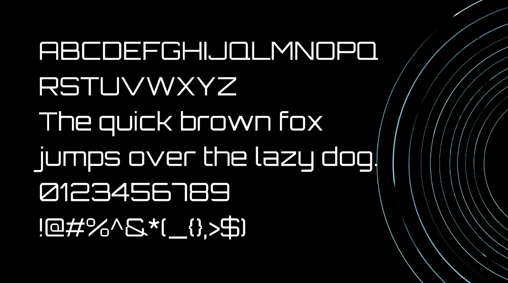

# Sagittarius A-Star: A Supermassive Book Store

## Design

### Colour Scheme

The colour scheme of "Sagittarius A-Star: A Supermassive Book Store" was generated from its background image, which captures the beauty of the universe. Because it plays a crucial role in setting the tone and atmosphere of the store, I wanted to keep it close to the astronomical theme by introducing the classic combination of black, silver and white, alongside two very different shades of the night sky: a subtle glaucous (a slightly desaturated blue) and an intense midnight green (a dark shade of cyan). The contrasting colour accent on the site is a mid-toned, golden grass shade called lion, which - as its name suggests - is a representation of the average colour of a lion's fur. I believe that, by being commonly associated with old book pages, it nicely breaks the cosmic convention here and adds a touch of warmth and balance.

I used [Image Colour Picker](https://imagecolorpicker.com/) to find the best shades in my home page background image, and [Coolors](https://coolors.co/000000-adadad-fafafa-ad9064-5e7ea8-194d60) to generate my colour palette.

### Typography

To find the right combination of well-matching fonts, I used one of the font pairing services, [fontpair.co](https://www.fontpair.co/). My first choice was a very popular and widely used sans-serif font called [Roboto](https://fonts.google.com/specimen/Roboto?query=roboto), designed by Google for Android devices. It's a classic and elegant typeface that ensures easy readability. Planning to use it for the main text content, such as product descriptions and form input fields, I needed another font for titles, subheadings, and form labels to complement it harmoniously. To my surprise, the match I liked the most was Roboto & Roboto — the simplest solution I could imagine but somehow never thought of.

For the website's main logo, navbar, main headings, and footer, I used another sans-serif font called [Orbitron](https://fonts.google.com/specimen/Orbitron?query=orbitron). I believe its modern and futuristic design added the scientific vibe I so desperately wanted to create.

I used [Google Fonts](https://fonts.google.com/) to import the fonts that style all of the text content, and [Font Awesome](https://fontawesome.com/) to provide icons across the website.