# TESTING

Return back to the [README.md](README.md) file.

## Introduction

Software testing is a common practice and a crucial step in the development process that ensures the quality, functionality and reliability of a web application. There are two primary approaches to testing - manual and automated. They both play vital roles in the process.

Both manual and automated testing have their strengths and limitations, but let's focus on the strengths. Manual testing offers flexibility and human insight, while automated testing provides efficiency and repeatability. Combining these two approaches can help achieve comprehensive test coverage.

### Manual Testing

Manual Testing involves human testers who interact with the software and assess its behavior against predefined criteria. This method relies on the tester's intuition, experience, and creativity to identify defects, making it particularly effective in exploratory testing and scenarios where user interaction is complex or subjective. 

"Sagittarius A-Star: A Supermassive Book Store" has been tested manually to check if the project works according to the user stories, to check its performance in different browsers and to check its responsiveness at different resolutions. Some friends and family members were invited to test the app on their devices and to check for potential functionality issues.

### Automated Testing

Automated Testing, on the other hand, employs specialized testing tools and scripts to automate the execution of test cases and verification of results. It excels in repetitive, time-consuming, and regression testing scenarios, where the same tests need to be run repeatedly to ensure new code changes do not introduce defects. 

All tests described and documented in the Code Validation and the Lighthouse Audit sections are automated tests.

## Code Validation

[The W3C Markup Validation Service](https://validator.w3.org/) and [The W3C CSS Validation Service](https://jigsaw.w3.org/css-validator/) were used to validate every page of the project to ensure there were no syntax errors. The results clearly showed that the website stays in compliance with the standards and recommendations set by the World Wide Web Consortium.

[JSHint](https://jshint.com/), a static code analysis tool, was used to check if JavaScript source code complies with coding rules. No errors were found in this area. And finally, I have used the recommended [PEP8 CI Python Linter](https://pep8ci.herokuapp.com) to validate my Python file.

### HTML Validation

I have used the recommended [HTML W3C Validator](https://validator.w3.org) to validate all of my HTML files. No errors or warnings were found. Django allauth templates were not tested. Pages that required user authentication were validated by direct input.

| Page | W3C URL | Screenshot | Notes |
| --- | --- | --- | --- |
| Home | [W3C](https://validator.w3.org/nu/?doc=https%3A%2F%2Fsagittarius-a-star-ab236042b163.herokuapp.com%2F) | 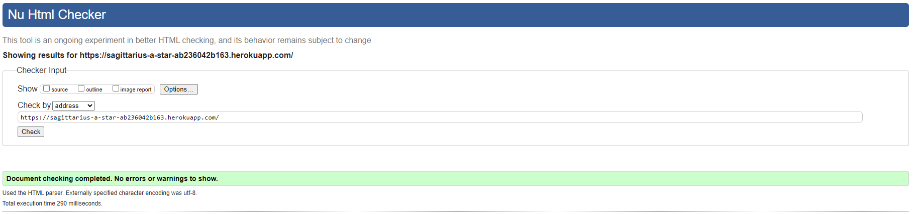 | Pass: No Errors |
| Products | [W3C](https://validator.w3.org/nu/?doc=https%3A%2F%2Fsagittarius-a-star-ab236042b163.herokuapp.com%2Fproducts%2F) | 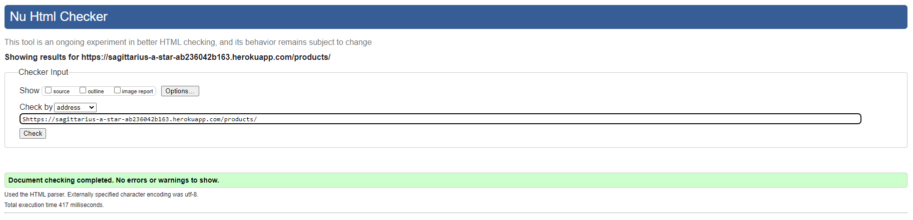 | Pass: No Errors |
| Product Detail | [W3C](https://validator.w3.org/nu/?doc=https%3A%2F%2Fsagittarius-a-star-ab236042b163.herokuapp.com%2Fproducts%2F2%2F) | 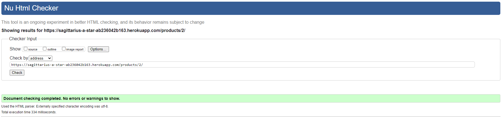 | Pass: No Errors |
| Add Product | [W3C](https://validator.w3.org/nu/#textarea) |  | Pass: No Errors |
| Edit Product | [W3C](https://validator.w3.org/nu/#textarea) |  | Pass: No Errors |
| Bag | [W3C](https://validator.w3.org/nu/?doc=https%3A%2F%2Fsagittarius-a-star-ab236042b163.herokuapp.com%2Fbag%2F) | 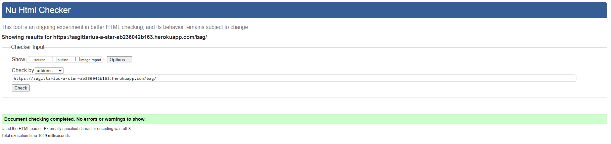 | Pass: No Errors |
| Checkout | [W3C](https://validator.w3.org/nu/?doc=https%3A%2F%2Fsagittarius-a-star-ab236042b163.herokuapp.com%2Fcheckout%2F) | 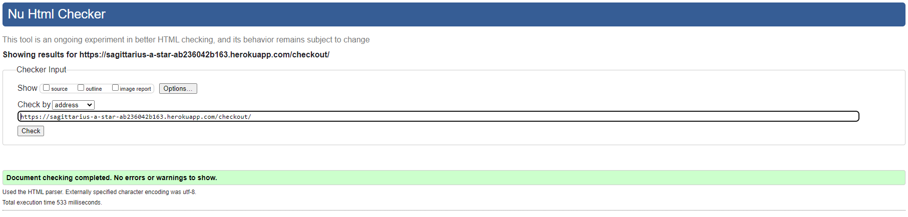 | Pass: No Errors |
| Checkout Success | [W3C](https://validator.w3.org/nu/?doc=https%3A%2F%2Fsagittarius-a-star-ab236042b163.herokuapp.com%2Fcheckout%2Fcheckout_success%2F2541D772F60543C38B84B7BA09FCA42B) | 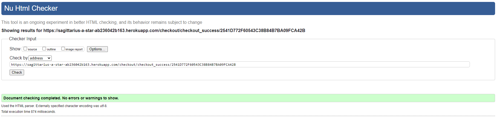 | Pass: No Errors |
| User Profile | [W3C](https://validator.w3.org/nu/#textarea) | 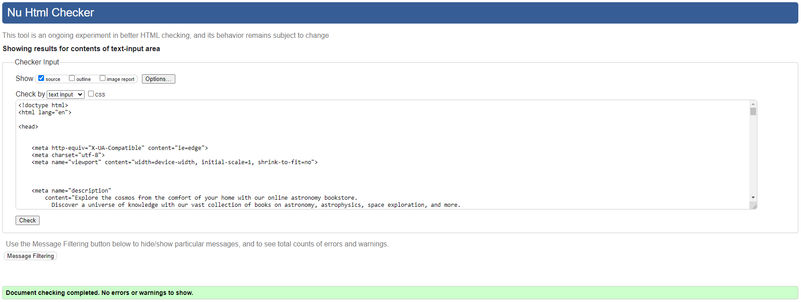 | Pass: No Errors |
| Contact | [W3C](https://validator.w3.org/nu/?doc=https%3A%2F%2Fsagittarius-a-star-ab236042b163.herokuapp.com%2Fcontact%2F) | 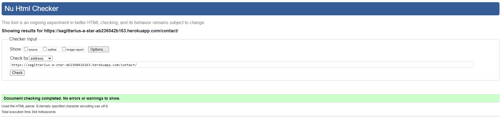 | Pass: No Errors |

### CSS Validation

I have used the recommended [CSS Jigsaw Validator](https://jigsaw.w3.org/css-validator) to validate my CSS files. No errors were found.

| File | Screenshot | Notes |
| --- | --- | --- |
| base.css | 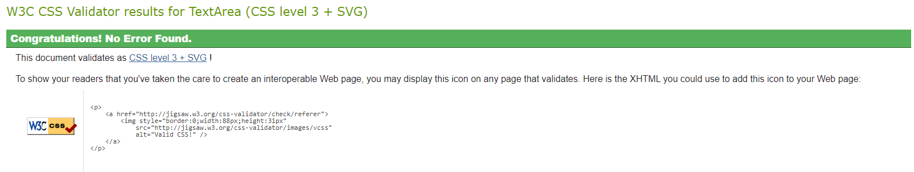 | Pass: No Errors |
| checkout.css | 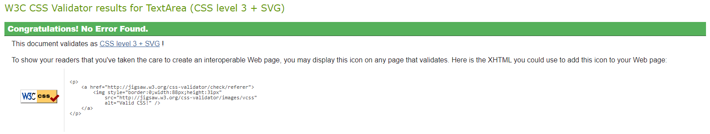 | Pass: No Errors |
| profile.css | 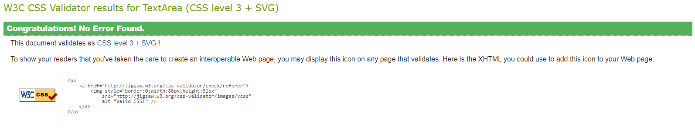 | Pass: No Errors |

### JS Hint Testing

I have used [JSHint](https://jshint.com/) to identify potential errors in my JavaScript file. No errors were found.

| File | Screenshot | Notes |
| --- | --- | --- |
| stripe_elements.js | 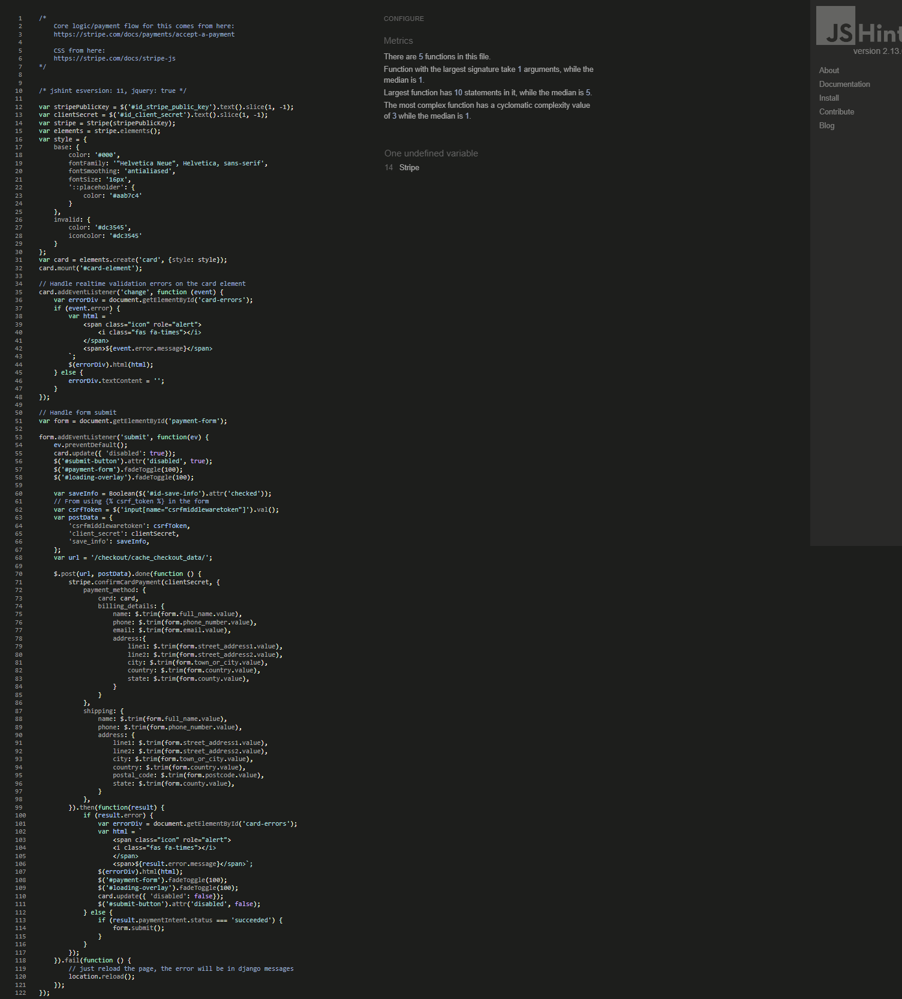 | Undefined Stripe element |
| countryfields.js | 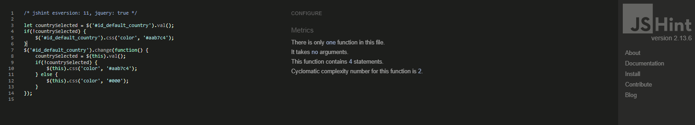 | Pass : No Errors |
| script from bag.html | 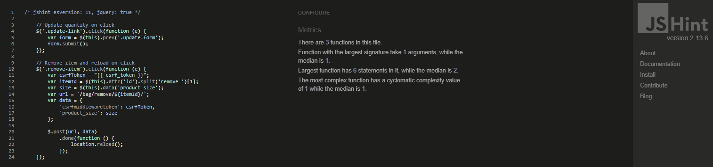 | Pass: No Errors |
| script from product.html | 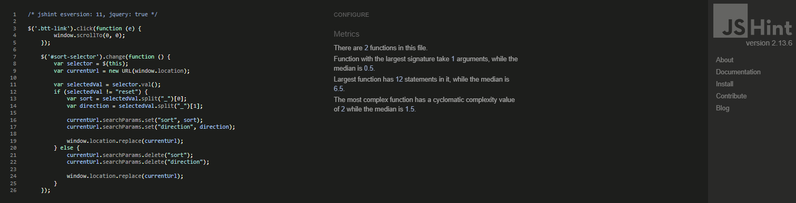 | Pass: No Errors |
| script from add/edit_product.html | 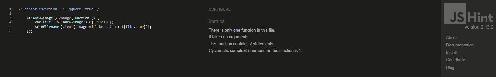 | Pass: No Errors |
| script from quantity_input_script.html | 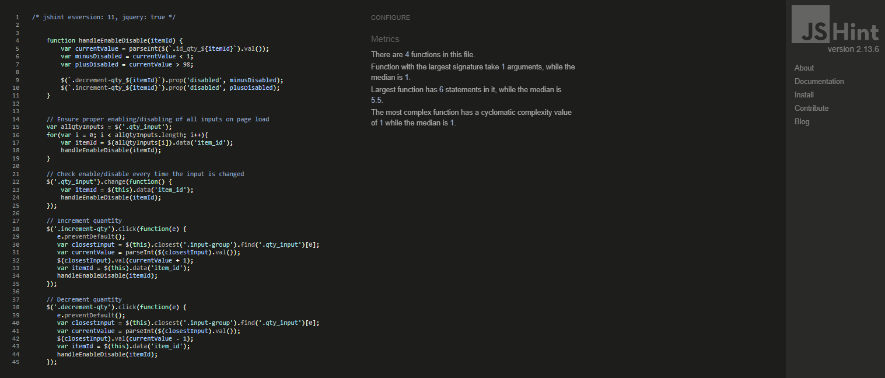 | Pass: No Errors |

### Python Testing

I have used the recommended [PEP8 CI Python Linter](https://pep8ci.herokuapp.com) to validate my Python file.

| Directory | File | CI URL | Screenshot | Notes |
| --- | --- | --- | --- | --- |
| bag | contexts.py | [PEP8 CI](https://pep8ci.herokuapp.com/https://raw.githubusercontent.com/NataliaCzeladka/sagittarius-a-star/main/bag/contexts.py) | 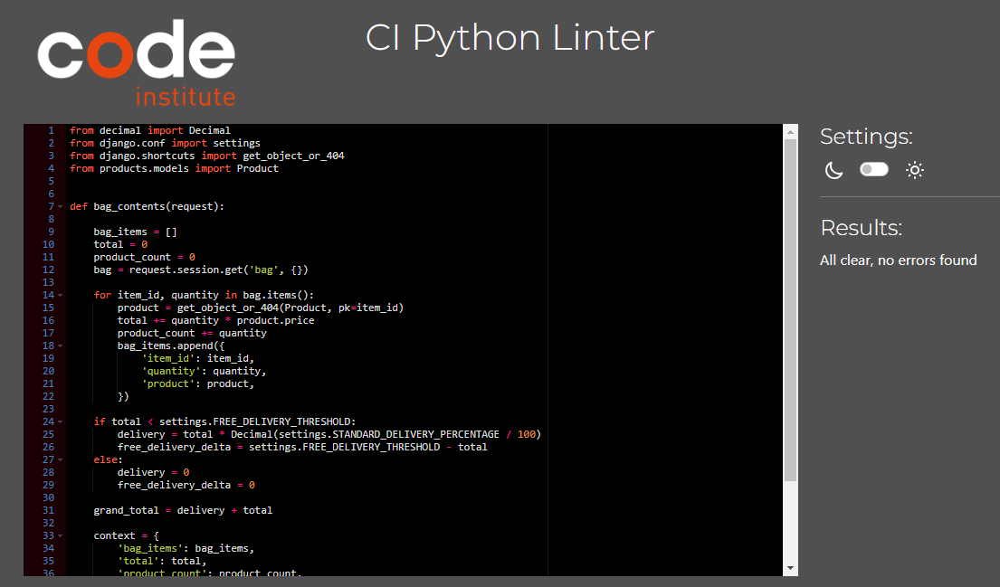 | No Errors Found |
| bag | bag_tools.py | [PEP8 CI](https://pep8ci.herokuapp.com/https://raw.githubusercontent.com/NataliaCzeladka/sagittarius-a-star/main/bag/templatetags/bag_tools.py) | 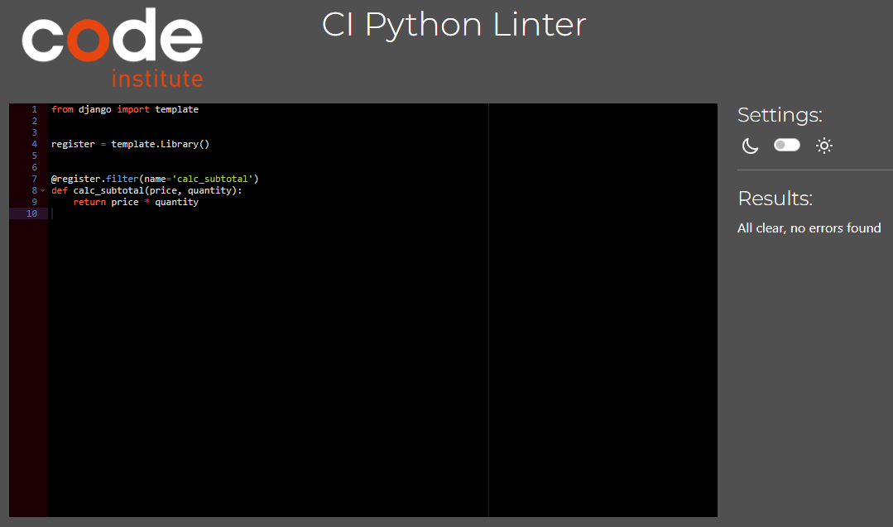 | No Errors Found |
| bag | urls.py | [PEP8 CI](https://pep8ci.herokuapp.com/https://raw.githubusercontent.com/NataliaCzeladka/sagittarius-a-star/main/bag/urls.py) | 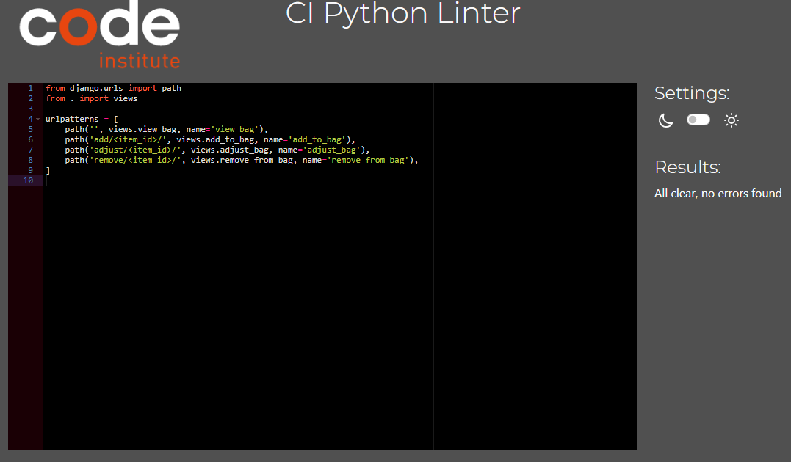 | No Errors Found |
| bag | views.py | [PEP8 CI](https://pep8ci.herokuapp.com/https://raw.githubusercontent.com/NataliaCzeladka/sagittarius-a-star/main/bag/views.py) | 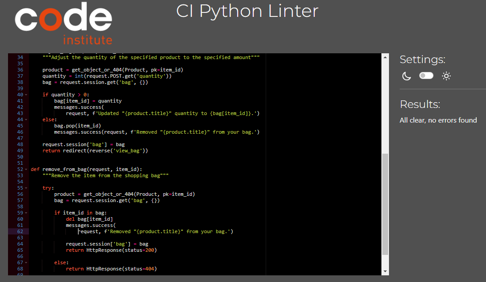 | No Errors Found |
| checkout | admin.py | [PEP8 CI](https://pep8ci.herokuapp.com/https://raw.githubusercontent.com/NataliaCzeladka/sagittarius-a-star/main/checkout/admin.py) | 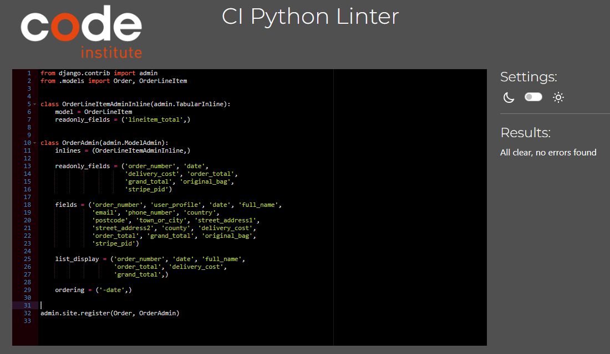 | No Errors Found |
| checkout | forms.py | [PEP8 CI](https://pep8ci.herokuapp.com/https://raw.githubusercontent.com/NataliaCzeladka/sagittarius-a-star/main/checkout/forms.py) | 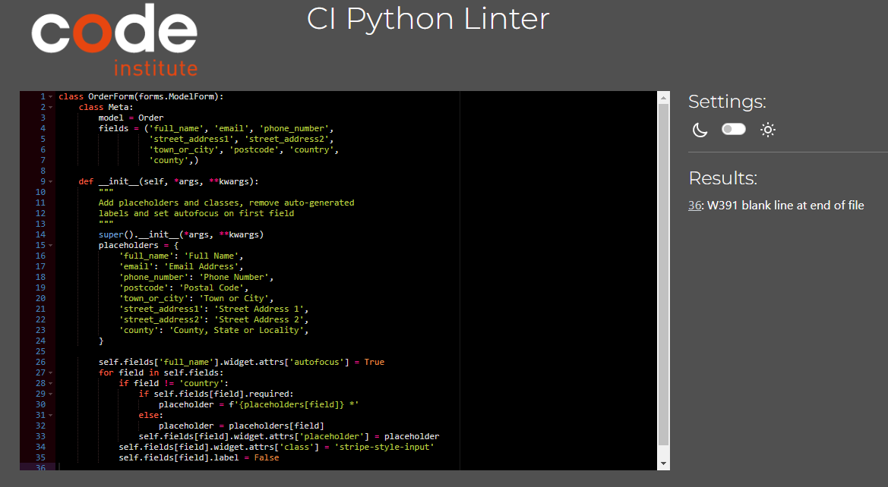 | No Errors Found |
| checkout | models.py | [PEP8 CI](https://pep8ci.herokuapp.com/https://raw.githubusercontent.com/NataliaCzeladka/sagittarius-a-star/main/checkout/models.py) | 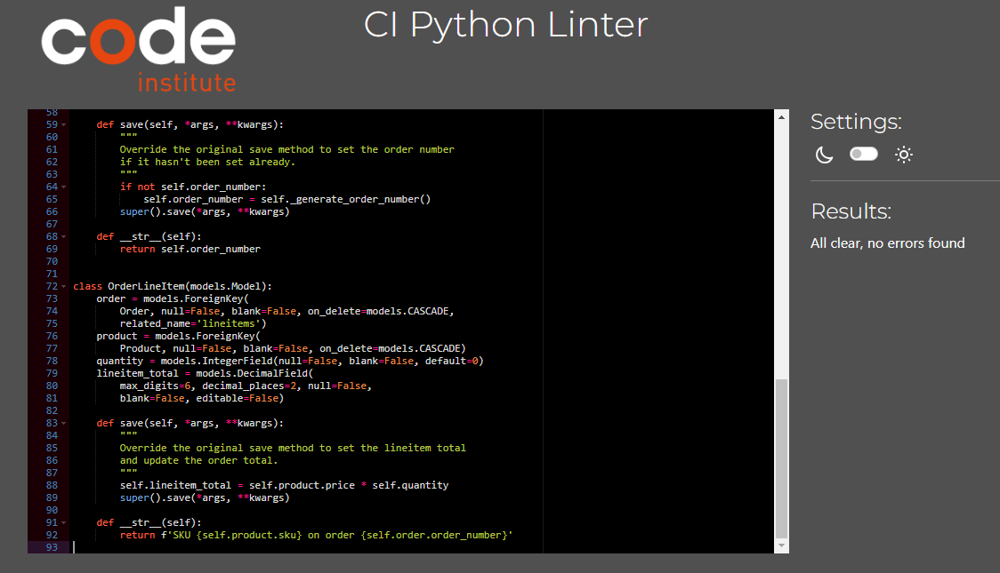 | No Errors Found |
| checkout | signals.py | [PEP8 CI](https://pep8ci.herokuapp.com/https://raw.githubusercontent.com/NataliaCzeladka/sagittarius-a-star/main/checkout/signals.py) | 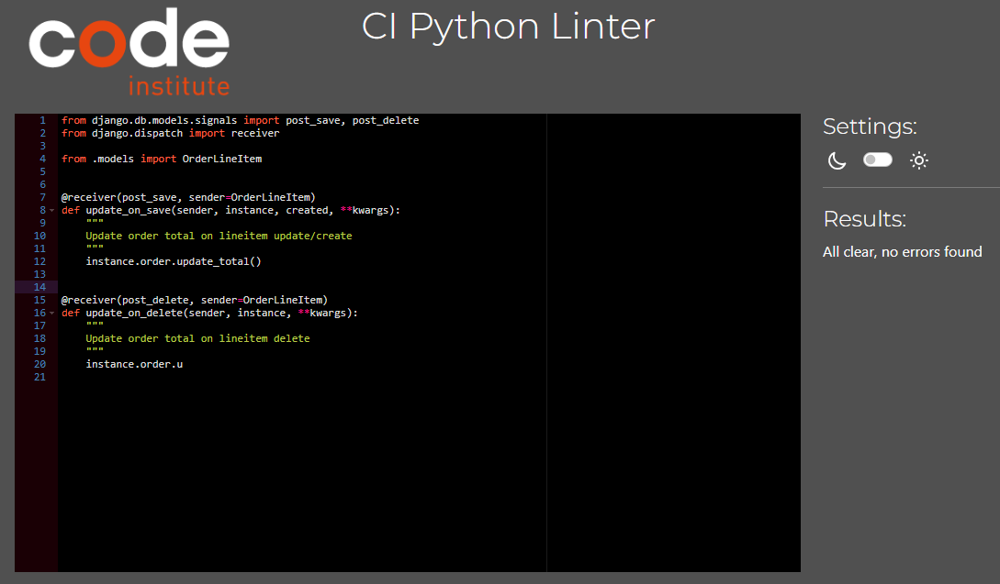 | No Errors Found |
| checkout | urls.py | [PEP8 CI](https://pep8ci.herokuapp.com/https://raw.githubusercontent.com/NataliaCzeladka/sagittarius-a-star/main/checkout/urls.py) | 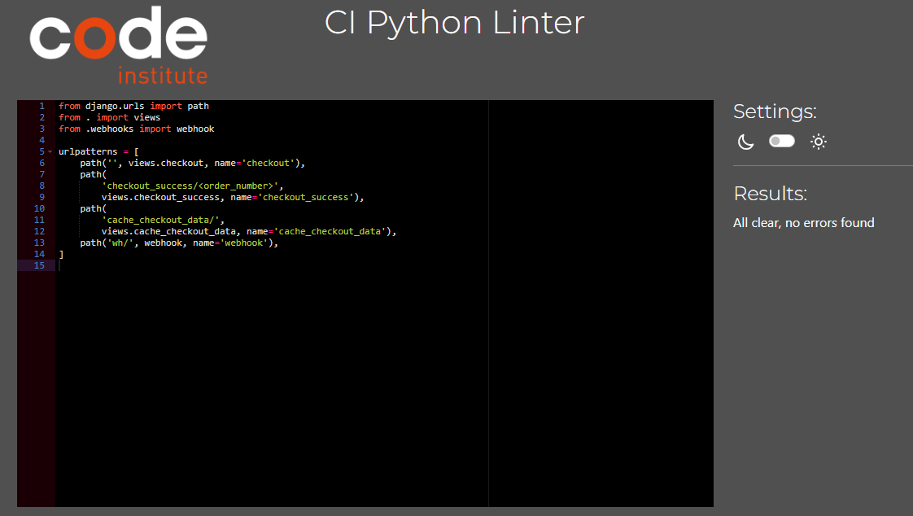 | No Errors Found |
| checkout | views.py | [PEP8 CI](https://pep8ci.herokuapp.com/https://raw.githubusercontent.com/NataliaCzeladka/sagittarius-a-star/main/checkout/views.py) | 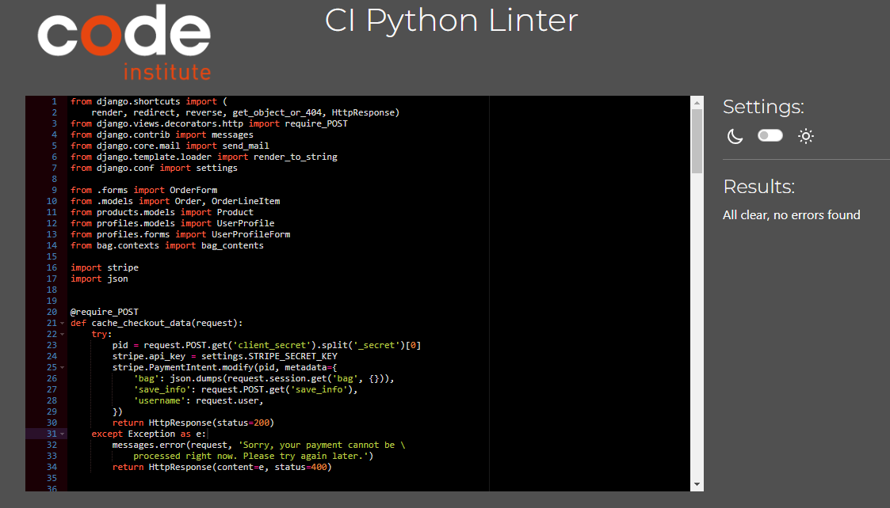 | No Errors Found |
| contact | admin.py | [PEP8 CI](https://pep8ci.herokuapp.com/https://raw.githubusercontent.com/NataliaCzeladka/sagittarius-a-star/main/contact/admin.py) | 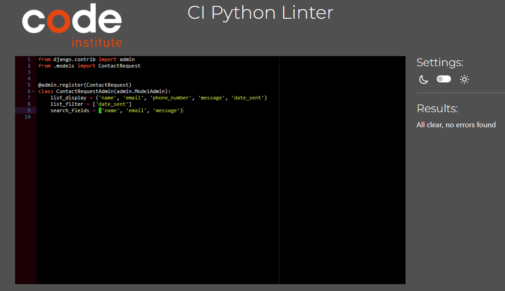 | No Errors Found |
| contact | forms.py | [PEP8 CI](https://pep8ci.herokuapp.com/https://raw.githubusercontent.com/NataliaCzeladka/sagittarius-a-star/main/contact/forms.py) | 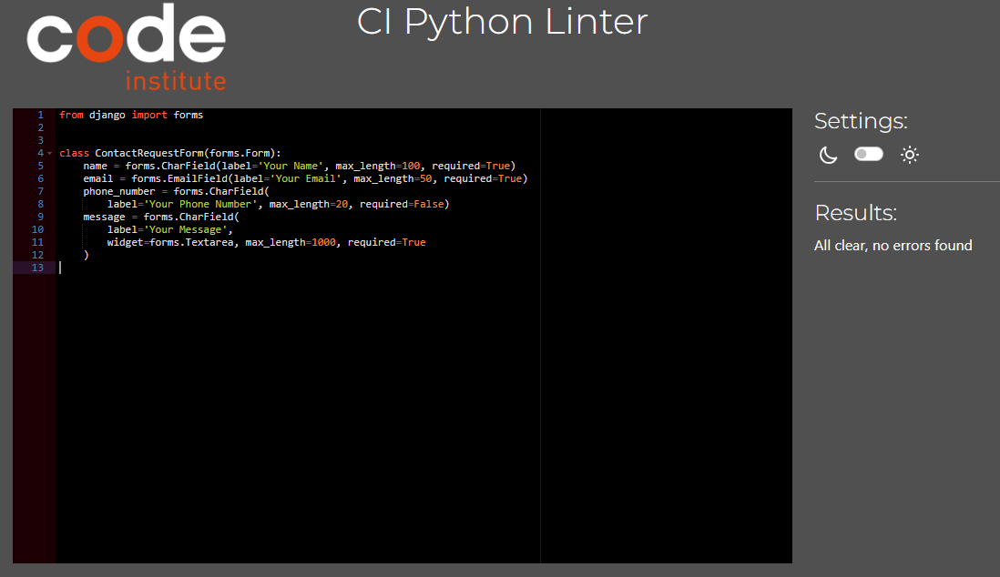 | No Errors Found |
| contact | models.py | [PEP8 CI](https://pep8ci.herokuapp.com/https://raw.githubusercontent.com/NataliaCzeladka/sagittarius-a-star/main/contact/models.py) | 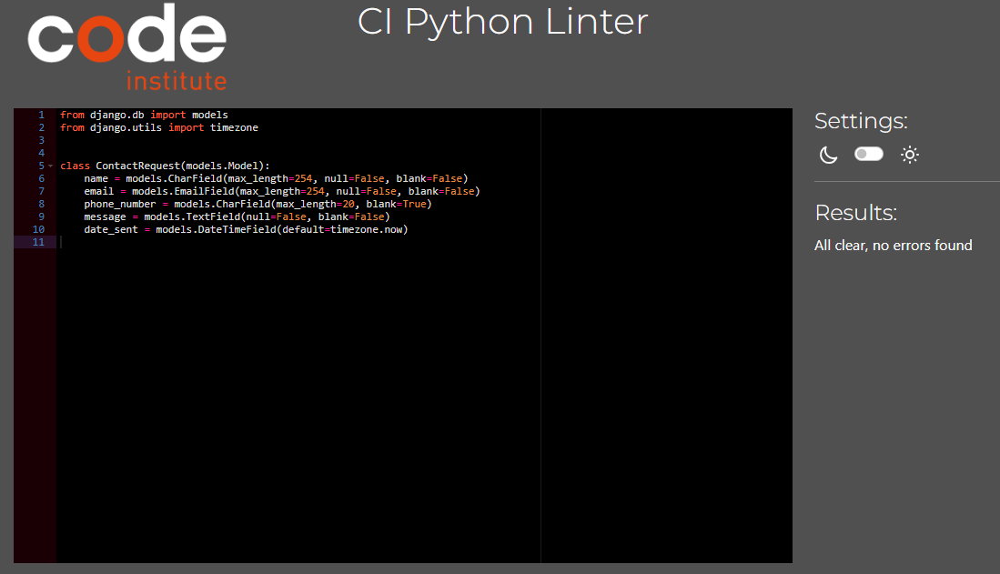 | No Errors Found |
| contact | urls.py | [PEP8 CI](https://pep8ci.herokuapp.com/https://raw.githubusercontent.com/NataliaCzeladka/sagittarius-a-star/main/contact/urls.py) | 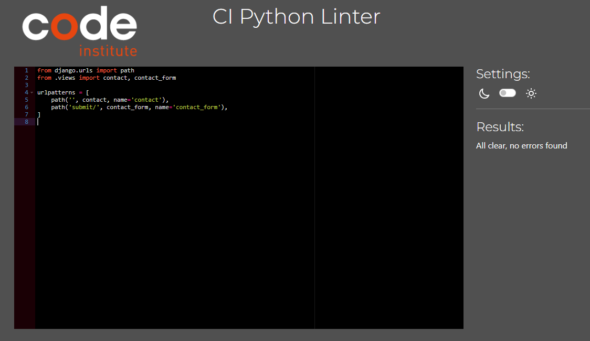 | No Errors Found |
| contact | views.py | [PEP8 CI](https://pep8ci.herokuapp.com/https://raw.githubusercontent.com/NataliaCzeladka/sagittarius-a-star/main/contact/views.py) | 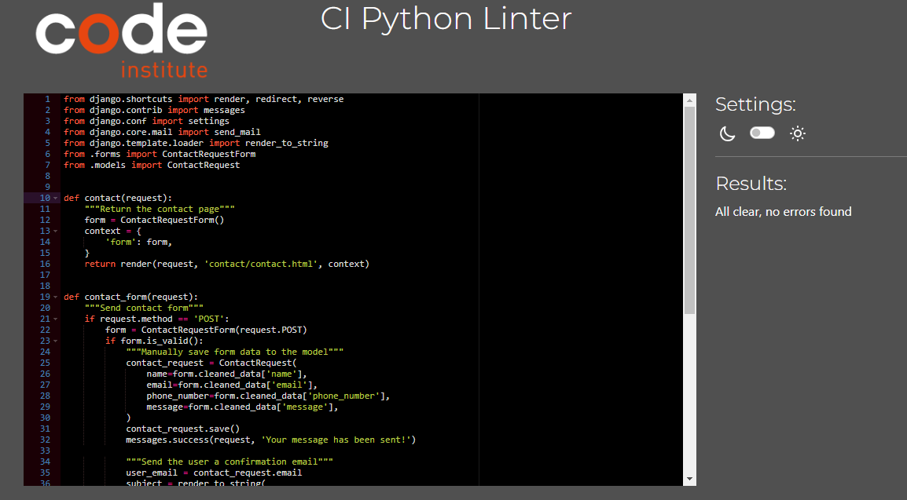 | No Errors Found |
| home | urls.py | [PEP8 CI](https://pep8ci.herokuapp.com/https://raw.githubusercontent.com/NataliaCzeladka/sagittarius-a-star/main/home/urls.py) | 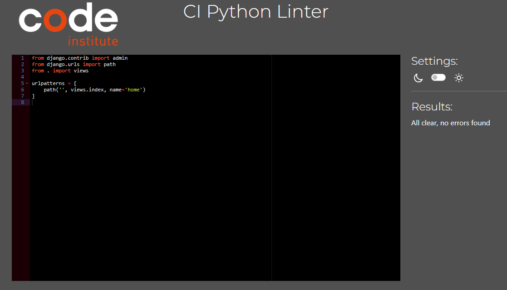 | No Errors Found |
| home | views.py | [PEP8 CI](https://pep8ci.herokuapp.com/https://raw.githubusercontent.com/NataliaCzeladka/sagittarius-a-star/main/home/views.py) | 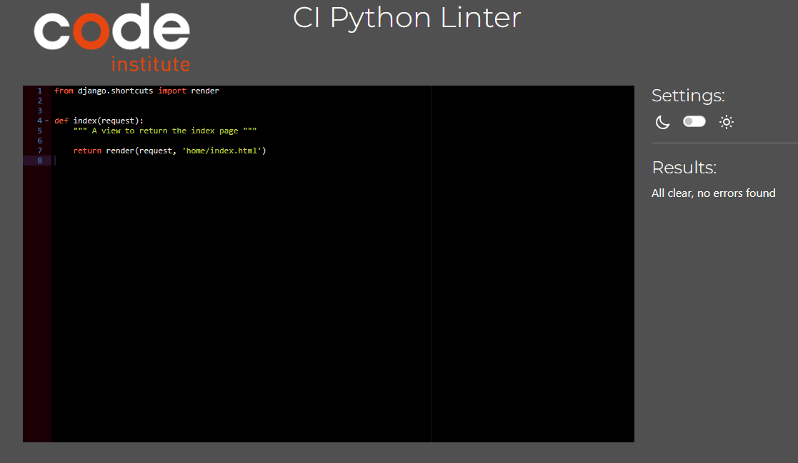 | No Errors Found |
| newsletter | admin.py | [PEP8 CI](https://pep8ci.herokuapp.com/https://raw.githubusercontent.com/NataliaCzeladka/sagittarius-a-star/main/newsletter/admin.py) | 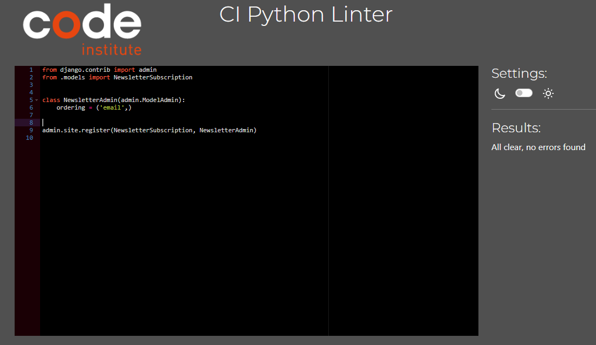 | No Errors Found |
| newsletter | forms.py | [PEP8 CI](https://pep8ci.herokuapp.com/https://raw.githubusercontent.com/NataliaCzeladka/sagittarius-a-star/main/newsletter/forms.py) |  | No Errors Found |
| newsletter | models.py | [PEP8 CI](https://pep8ci.herokuapp.com/https://raw.githubusercontent.com/NataliaCzeladka/sagittarius-a-star/main/newsletter/models.py) | 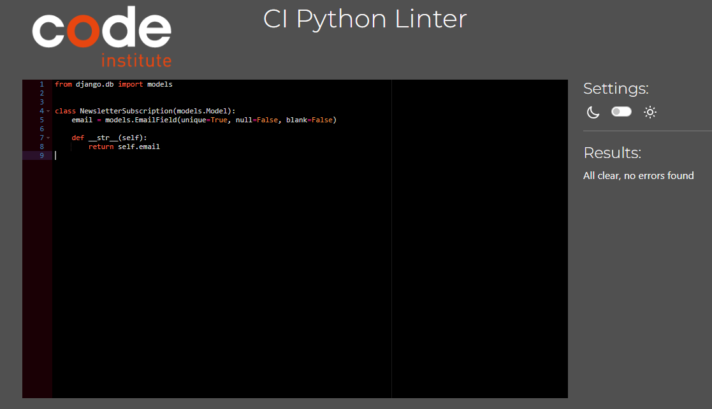 | No Errors Found |
| newsletter | urls.py | [PEP8 CI](https://pep8ci.herokuapp.com/https://raw.githubusercontent.com/NataliaCzeladka/sagittarius-a-star/main/newsletter/urls.py) | 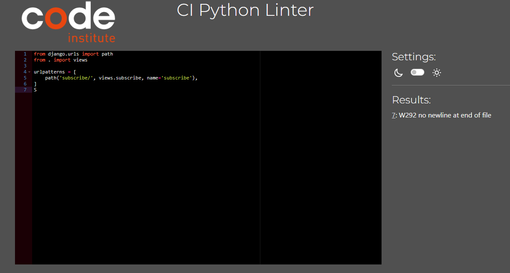 | No Errors Found |
| newsletter | views.py | [PEP8 CI](https://pep8ci.herokuapp.com/https://raw.githubusercontent.com/NataliaCzeladka/sagittarius-a-star/main/newsletter/views.py) | 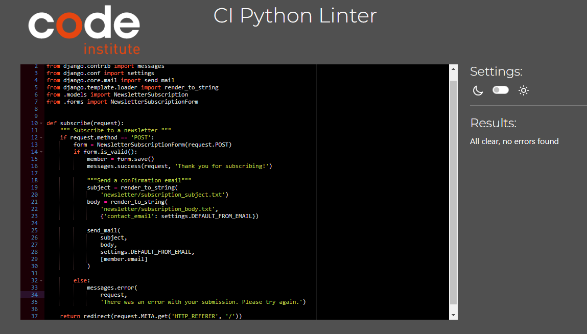 | No Errors Found |
| products | admin.py | [PEP8 CI](https://pep8ci.herokuapp.com/https://raw.githubusercontent.com/NataliaCzeladka/sagittarius-a-star/main/products/admin.py) | 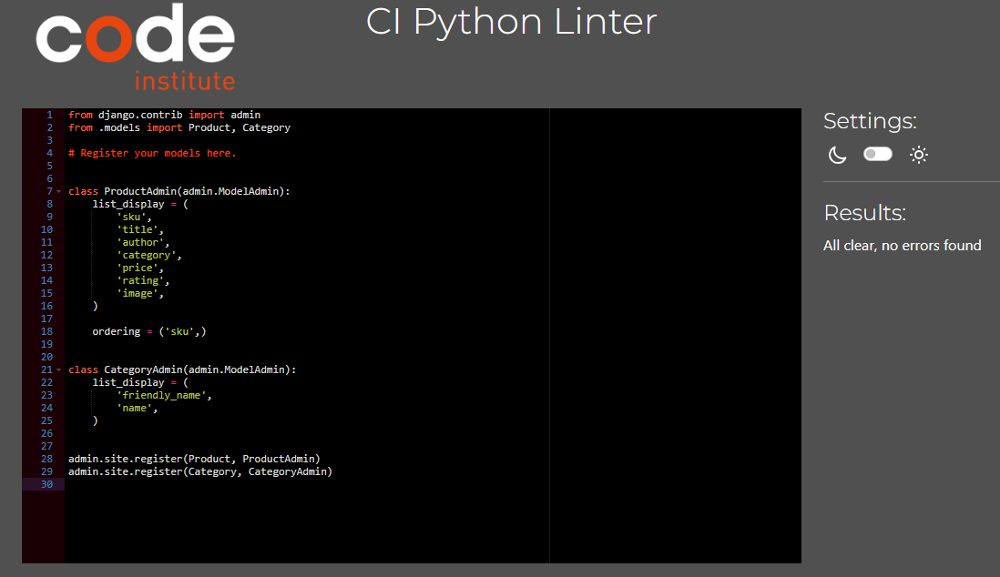 | No Errors Found |
| products | forms.py | [PEP8 CI](https://pep8ci.herokuapp.com/https://raw.githubusercontent.com/NataliaCzeladka/sagittarius-a-star/main/products/forms.py) | 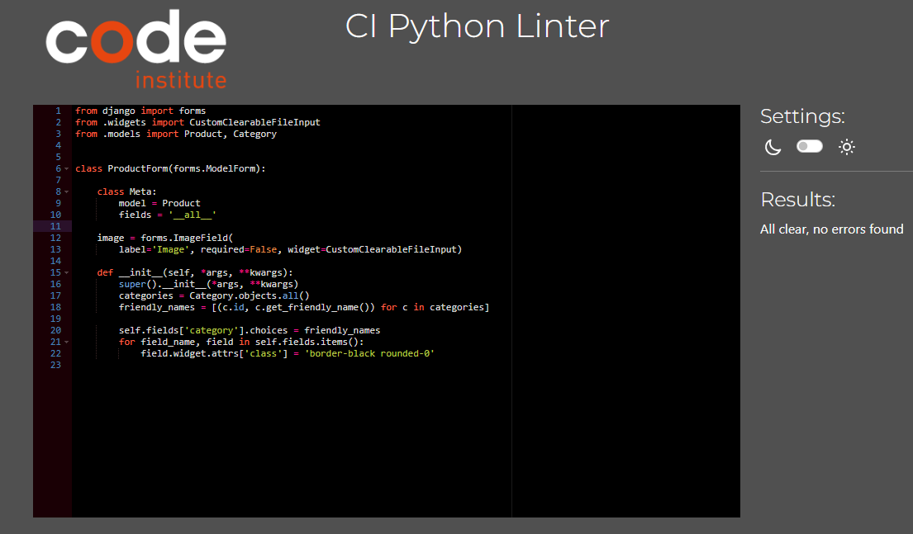 | No Errors Found |
| products | models.py | [PEP8 CI](https://pep8ci.herokuapp.com/https://raw.githubusercontent.com/NataliaCzeladka/sagittarius-a-star/main/products/models.py) | 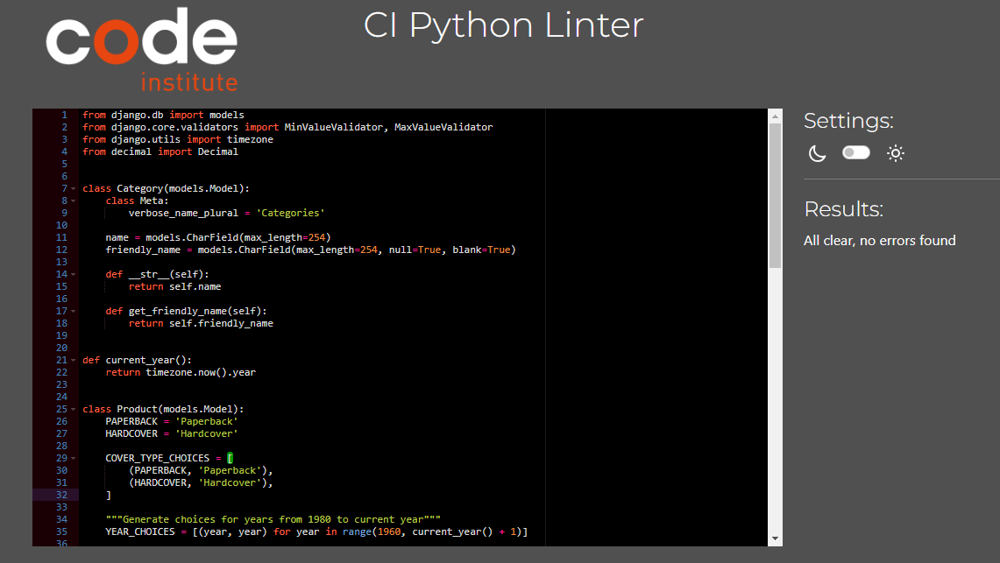 | No Errors Found |
| products | urls.py | [PEP8 CI](https://pep8ci.herokuapp.com/https://raw.githubusercontent.com/NataliaCzeladka/sagittarius-a-star/main/products/urls.py) | 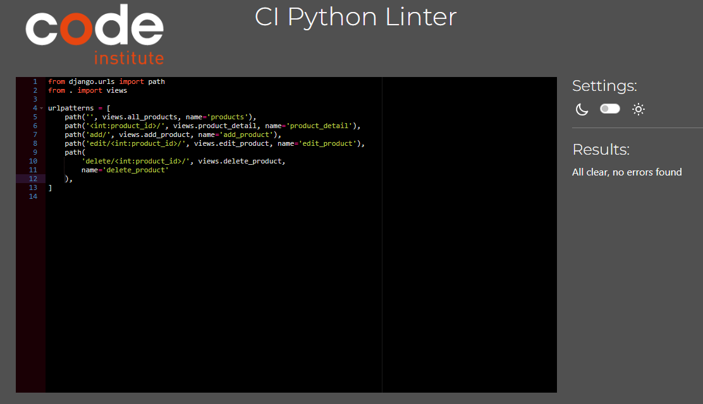 | No Errors Found |
| products | views.py | [PEP8 CI](https://pep8ci.herokuapp.com/https://raw.githubusercontent.com/NataliaCzeladka/sagittarius-a-star/main/products/views.py) | 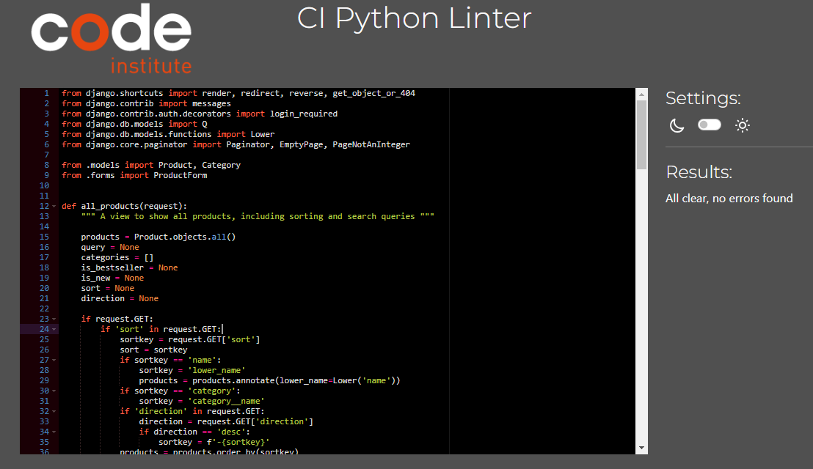 | No Errors Found |
| products | widgets.py | [PEP8 CI](https://pep8ci.herokuapp.com/https://raw.githubusercontent.com/NataliaCzeladka/sagittarius-a-star/main/products/widgets.py) | 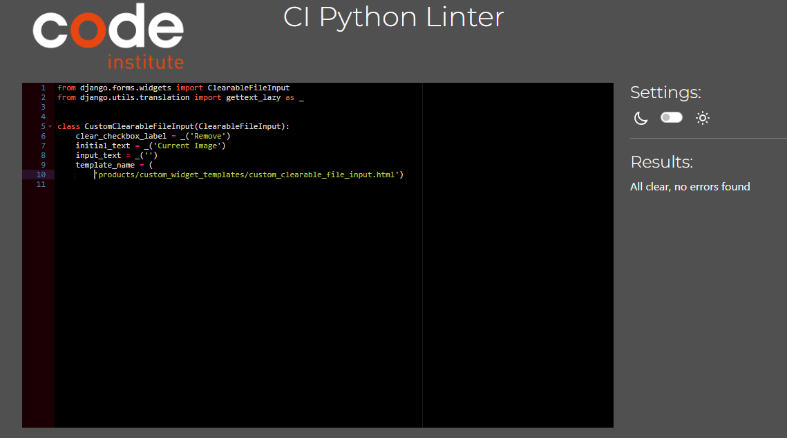 | No Errors Found |
| profiles | forms.py | [PEP8 CI](https://pep8ci.herokuapp.com/https://raw.githubusercontent.com/NataliaCzeladka/sagittarius-a-star/main/profiles/forms.py) | 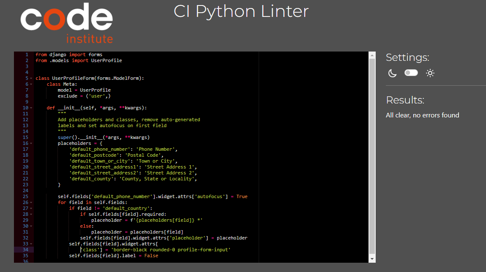 | No Errors Found |
| profiles | models.py | [PEP8 CI](https://pep8ci.herokuapp.com/https://raw.githubusercontent.com/NataliaCzeladka/sagittarius-a-star/main/profiles/models.py) | 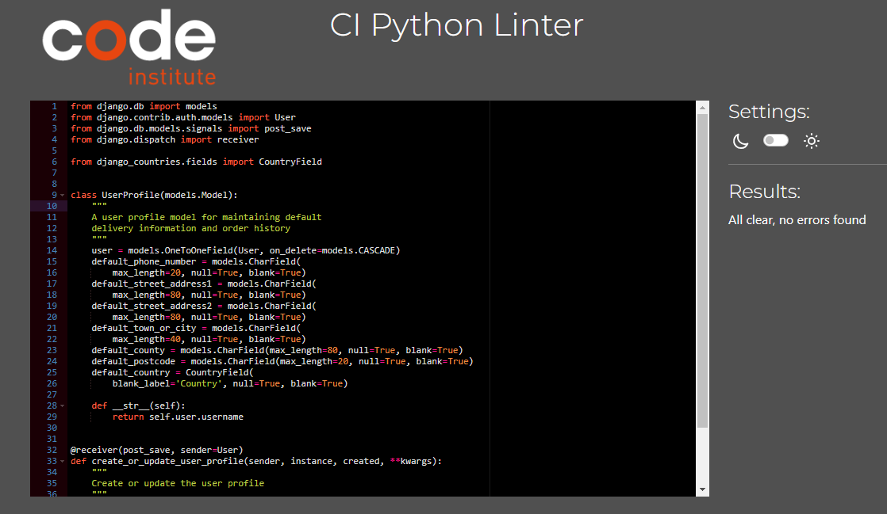 | No Errors Found |
| profiles | urls.py | [PEP8 CI](https://pep8ci.herokuapp.com/https://raw.githubusercontent.com/NataliaCzeladka/sagittarius-a-star/main/profiles/urls.py) |  | No Errors Found |
| profiles | views.py | [PEP8 CI](https://pep8ci.herokuapp.com/https://raw.githubusercontent.com/NataliaCzeladka/sagittarius-a-star/main/profiles/views.py) | 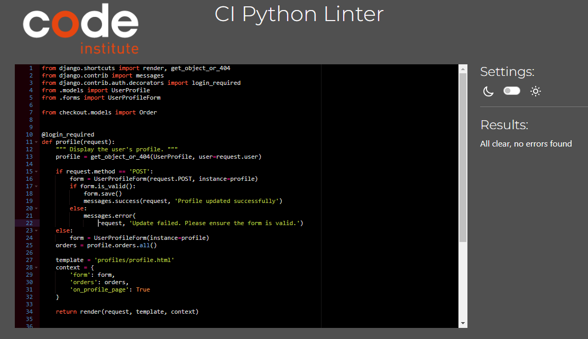 | No Errors Found |

## Browser Compatibility

## Responsiveness

## Lighthouse Audit

## User Stories Testing

## Fixed Bugs

## Unfixed Bugs
