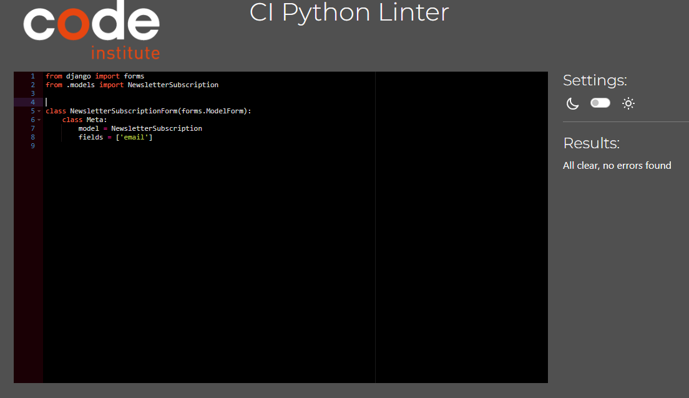
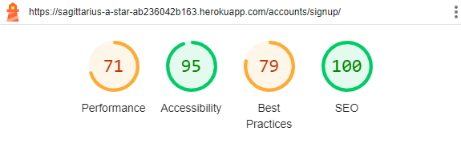
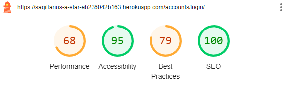

# TESTING

Return to the [README.md](README.md) file.

## Introduction

Software testing is a common practice and a crucial step in the development process that ensures the quality, functionality and reliability of a web application. There are two primary approaches to testing - manual and automated. They both play vital roles in the process.

Both manual and automated testing have their strengths and limitations, but let's focus on the strengths. Manual testing offers flexibility and human insight, while automated testing provides efficiency and repeatability. Combining these two approaches can help achieve comprehensive test coverage.

### Manual Testing

Manual Testing involves human testers who interact with the software and assess its behavior against predefined criteria. This method relies on the tester's intuition, experience, and creativity to identify defects, making it particularly effective in exploratory testing and scenarios where user interaction is complex or subjective. 

"Sagittarius A-Star: A Supermassive Book Store" has been tested manually to check if the project works according to the user stories, to check its performance in different browsers and to check its responsiveness at different resolutions. Some friends and family members were invited to test the app on their devices and to check for potential functionality issues.

### Automated Testing

Automated Testing, on the other hand, employs specialized testing tools and scripts to automate the execution of test cases and verification of results. It excels in repetitive, time-consuming, and regression testing scenarios, where the same tests need to be run repeatedly to ensure new code changes do not introduce defects. 

All tests described and documented in the Code Validation and the Lighthouse Audit sections are automated tests.

## Code Validation

[The W3C Markup Validation Service](https://validator.w3.org/) and [The W3C CSS Validation Service](https://jigsaw.w3.org/css-validator/) were used to validate every page of the project to ensure there were no syntax errors. The results clearly showed that the website stays in compliance with the standards and recommendations set by the World Wide Web Consortium.

[JSHint](https://jshint.com/), a static code analysis tool, was used to check if JavaScript source code complies with coding rules. No errors were found in this area. And finally, I have used the recommended [PEP8 CI Python Linter](https://pep8ci.herokuapp.com) to validate my Python files.

### HTML Validation

I have used the recommended [HTML W3C Validator](https://validator.w3.org) to validate all of my HTML files. No errors or warnings were found. Django allauth templates were not tested. Pages that required user authentication were validated by direct input.

| Page | W3C URL | Screenshot | Notes |
| --- | --- | --- | --- |
| Home | [W3C](https://validator.w3.org/nu/?doc=https%3A%2F%2Fsagittarius-a-star-ab236042b163.herokuapp.com%2F) |  | Pass: No Errors |
| Products | [W3C](https://validator.w3.org/nu/?doc=https%3A%2F%2Fsagittarius-a-star-ab236042b163.herokuapp.com%2Fproducts%2F) |  | Pass: No Errors |
| Product Detail | [W3C](https://validator.w3.org/nu/?doc=https%3A%2F%2Fsagittarius-a-star-ab236042b163.herokuapp.com%2Fproducts%2F2%2F) |  | Pass: No Errors |
| Add Product | [W3C](https://validator.w3.org/nu/#textarea) |  | Pass: No Errors |
| Edit Product | [W3C](https://validator.w3.org/nu/#textarea) |  | Pass: No Errors |
| Bag | [W3C](https://validator.w3.org/nu/?doc=https%3A%2F%2Fsagittarius-a-star-ab236042b163.herokuapp.com%2Fbag%2F) |  | Pass: No Errors |
| Checkout | [W3C](https://validator.w3.org/nu/?doc=https%3A%2F%2Fsagittarius-a-star-ab236042b163.herokuapp.com%2Fcheckout%2F) |  | Pass: No Errors |
| Checkout Success | [W3C](https://validator.w3.org/nu/?doc=https%3A%2F%2Fsagittarius-a-star-ab236042b163.herokuapp.com%2Fcheckout%2Fcheckout_success%2F2541D772F60543C38B84B7BA09FCA42B) |  | Pass: No Errors |
| User Profile | [W3C](https://validator.w3.org/nu/#textarea) |  | Pass: No Errors |
| Contact | [W3C](https://validator.w3.org/nu/?doc=https%3A%2F%2Fsagittarius-a-star-ab236042b163.herokuapp.com%2Fcontact%2F) |  | Pass: No Errors |

### CSS Validation

I have used the recommended [CSS Jigsaw Validator](https://jigsaw.w3.org/css-validator) to validate my CSS files. No errors were found.

| File | Screenshot | Notes |
| --- | --- | --- |
| base.css |  | Pass: No Errors |
| checkout.css |  | Pass: No Errors |
| profile.css |  | Pass: No Errors |

### JS Hint Testing

I have used [JSHint](https://jshint.com/) to identify potential errors in my JavaScript file. No errors were found.

| File | Screenshot | Notes |
| --- | --- | --- |
| stripe_elements.js |  | Undefined Stripe element |
| countryfields.js |  | Pass : No Errors |
| script from bag.html |  | Pass: No Errors |
| script from product.html |  | Pass: No Errors |
| script from add/edit_product.html |  | Pass: No Errors |
| script from quantity_input_script.html |  | Pass: No Errors |

### Python Testing

I have used the recommended [PEP8 CI Python Linter](https://pep8ci.herokuapp.com) to validate my Python files.

| Directory | File | CI URL | Screenshot | Notes |
| --- | --- | --- | --- | --- |
| bag | contexts.py | [PEP8 CI](https://pep8ci.herokuapp.com/https://raw.githubusercontent.com/NataliaCzeladka/sagittarius-a-star/main/bag/contexts.py) |  | No Errors Found |
| bag | bag_tools.py | [PEP8 CI](https://pep8ci.herokuapp.com/https://raw.githubusercontent.com/NataliaCzeladka/sagittarius-a-star/main/bag/templatetags/bag_tools.py) |  | No Errors Found |
| bag | urls.py | [PEP8 CI](https://pep8ci.herokuapp.com/https://raw.githubusercontent.com/NataliaCzeladka/sagittarius-a-star/main/bag/urls.py) |  | No Errors Found |
| bag | views.py | [PEP8 CI](https://pep8ci.herokuapp.com/https://raw.githubusercontent.com/NataliaCzeladka/sagittarius-a-star/main/bag/views.py) |  | No Errors Found |
| checkout | admin.py | [PEP8 CI](https://pep8ci.herokuapp.com/https://raw.githubusercontent.com/NataliaCzeladka/sagittarius-a-star/main/checkout/admin.py) |  | No Errors Found |
| checkout | forms.py | [PEP8 CI](https://pep8ci.herokuapp.com/https://raw.githubusercontent.com/NataliaCzeladka/sagittarius-a-star/main/checkout/forms.py) |  | No Errors Found |
| checkout | models.py | [PEP8 CI](https://pep8ci.herokuapp.com/https://raw.githubusercontent.com/NataliaCzeladka/sagittarius-a-star/main/checkout/models.py) |  | No Errors Found |
| checkout | signals.py | [PEP8 CI](https://pep8ci.herokuapp.com/https://raw.githubusercontent.com/NataliaCzeladka/sagittarius-a-star/main/checkout/signals.py) |  | No Errors Found |
| checkout | urls.py | [PEP8 CI](https://pep8ci.herokuapp.com/https://raw.githubusercontent.com/NataliaCzeladka/sagittarius-a-star/main/checkout/urls.py) |  | No Errors Found |
| checkout | views.py | [PEP8 CI](https://pep8ci.herokuapp.com/https://raw.githubusercontent.com/NataliaCzeladka/sagittarius-a-star/main/checkout/views.py) |  | No Errors Found |
| contact | admin.py | [PEP8 CI](https://pep8ci.herokuapp.com/https://raw.githubusercontent.com/NataliaCzeladka/sagittarius-a-star/main/contact/admin.py) |  | No Errors Found |
| contact | forms.py | [PEP8 CI](https://pep8ci.herokuapp.com/https://raw.githubusercontent.com/NataliaCzeladka/sagittarius-a-star/main/contact/forms.py) |  | No Errors Found |
| contact | models.py | [PEP8 CI](https://pep8ci.herokuapp.com/https://raw.githubusercontent.com/NataliaCzeladka/sagittarius-a-star/main/contact/models.py) |  | No Errors Found |
| contact | urls.py | [PEP8 CI](https://pep8ci.herokuapp.com/https://raw.githubusercontent.com/NataliaCzeladka/sagittarius-a-star/main/contact/urls.py) |  | No Errors Found |
| contact | views.py | [PEP8 CI](https://pep8ci.herokuapp.com/https://raw.githubusercontent.com/NataliaCzeladka/sagittarius-a-star/main/contact/views.py) |  | No Errors Found |
| home | urls.py | [PEP8 CI](https://pep8ci.herokuapp.com/https://raw.githubusercontent.com/NataliaCzeladka/sagittarius-a-star/main/home/urls.py) |  | No Errors Found |
| home | views.py | [PEP8 CI](https://pep8ci.herokuapp.com/https://raw.githubusercontent.com/NataliaCzeladka/sagittarius-a-star/main/home/views.py) |  | No Errors Found |
| newsletter | admin.py | [PEP8 CI](https://pep8ci.herokuapp.com/https://raw.githubusercontent.com/NataliaCzeladka/sagittarius-a-star/main/newsletter/admin.py) |  | No Errors Found |
| newsletter | forms.py | [PEP8 CI](https://pep8ci.herokuapp.com/https://raw.githubusercontent.com/NataliaCzeladka/sagittarius-a-star/main/newsletter/forms.py) |  | No Errors Found |
| newsletter | models.py | [PEP8 CI](https://pep8ci.herokuapp.com/https://raw.githubusercontent.com/NataliaCzeladka/sagittarius-a-star/main/newsletter/models.py) |  | No Errors Found |
| newsletter | urls.py | [PEP8 CI](https://pep8ci.herokuapp.com/https://raw.githubusercontent.com/NataliaCzeladka/sagittarius-a-star/main/newsletter/urls.py) |  | No Errors Found |
| newsletter | views.py | [PEP8 CI](https://pep8ci.herokuapp.com/https://raw.githubusercontent.com/NataliaCzeladka/sagittarius-a-star/main/newsletter/views.py) |  | No Errors Found |
| products | admin.py | [PEP8 CI](https://pep8ci.herokuapp.com/https://raw.githubusercontent.com/NataliaCzeladka/sagittarius-a-star/main/products/admin.py) |  | No Errors Found |
| products | forms.py | [PEP8 CI](https://pep8ci.herokuapp.com/https://raw.githubusercontent.com/NataliaCzeladka/sagittarius-a-star/main/products/forms.py) |  | No Errors Found |
| products | models.py | [PEP8 CI](https://pep8ci.herokuapp.com/https://raw.githubusercontent.com/NataliaCzeladka/sagittarius-a-star/main/products/models.py) |  | No Errors Found |
| products | urls.py | [PEP8 CI](https://pep8ci.herokuapp.com/https://raw.githubusercontent.com/NataliaCzeladka/sagittarius-a-star/main/products/urls.py) |  | No Errors Found |
| products | views.py | [PEP8 CI](https://pep8ci.herokuapp.com/https://raw.githubusercontent.com/NataliaCzeladka/sagittarius-a-star/main/products/views.py) |  | No Errors Found |
| products | widgets.py | [PEP8 CI](https://pep8ci.herokuapp.com/https://raw.githubusercontent.com/NataliaCzeladka/sagittarius-a-star/main/products/widgets.py) |  | No Errors Found |
| profiles | forms.py | [PEP8 CI](https://pep8ci.herokuapp.com/https://raw.githubusercontent.com/NataliaCzeladka/sagittarius-a-star/main/profiles/forms.py) |  | No Errors Found |
| profiles | models.py | [PEP8 CI](https://pep8ci.herokuapp.com/https://raw.githubusercontent.com/NataliaCzeladka/sagittarius-a-star/main/profiles/models.py) |  | No Errors Found |
| profiles | urls.py | [PEP8 CI](https://pep8ci.herokuapp.com/https://raw.githubusercontent.com/NataliaCzeladka/sagittarius-a-star/main/profiles/urls.py) |  | No Errors Found |
| profiles | views.py | [PEP8 CI](https://pep8ci.herokuapp.com/https://raw.githubusercontent.com/NataliaCzeladka/sagittarius-a-star/main/profiles/views.py) |  | No Errors Found |

## Browser Compatibility

I have tested my deployed project on multiple browsers to check for compatibility issues.

| Browser | Screenshot | Notes |
| --- | --- | --- |
| Chrome |  | Works as expected |
| Firefox |  | Works as expected |
| Edge |  | Works as expected |
| Opera |  | Works as expected |

## Responsiveness Testing

I have tested my deployed project on multiple devices to check for responsiveness issues. It responds well to different screen sizes ensuring that users can access and navigate the content effortlessly, regardless of their chosen device. No design or functionality issues were found.

| Device | Screenshot 1 | Screenshot 2 | Screenshot 3 | Notes |
| --- | --- | --- | --- | --- |
| Mobile (DevTools) |  |  |  | Works as expected |
| Tablet (DevTools) |  |  |  | Works as expected |
| Desktop |  |  |  | Works as expected |

## Lighthouse Audit

I have tested my deployed project using the Lighthouse Audit tool to check for any major issues. 

| Page | Size | Screenshot | Notes |
| --- | --- | --- | --- |
| Home | Mobile |  | Some minor warnings |
| Home | Desktop |  | Some minor warnings |
| Products | Mobile |  | Some minor warnings |
| Products | Desktop |  | Some minor warnings |
| Product Detail | Mobile |  | Some minor warnings |
| Product Detail | Desktop |  | Some minor warnings |
| Sign Up | Mobile |  | Some minor warnings |
| Sign Up | Desktop |  | Some minor warnings |
| Sign In | Mobile |  | Some minor warnings |
| Sign In | Desktop |  | Some minor warnings |
| Sign Out | Mobile |  | Some minor warnings |
| Sign Out | Desktop |  | Some minor warnings |
| Add Product | Mobile |  | Some minor warnings |
| Add Product | Desktop |  | Some minor warnings |
| Edit Product | Mobile |  | Some minor warnings |
| Edit Product | Desktop |  | Some minor warnings |
| Shopping Bag | Mobile |  | Some minor warnings |
| Shopping Bag | Desktop |  | Some minor warnings |
| Checkout | Mobile |  | Some minor warnings |
| Checkout | Desktop |  | Some minor warnings |
| Checkout Success | Mobile |  | Some minor warnings |
| Checkout Success | Desktop |  | Some minor warnings |
| User Profile | Mobile |  | Some minor warnings |
| User Profile | Desktop |  | Some minor warnings |
| Contact | Mobile |  | Some minor warnings |
| Contact | Desktop |  | Some minor warnings |

## User Stories Testing

EPIC 1: General Site Functionality

| User Story | Completed? |
| --- | --- |
| As a first-time user, I would like to find clear information about the site's purpose to decide if it aligns with my interests and if I wish to explore it further. | ✔️ |
| As a site user, I want to interact with a visually appealing, intuitive, responsive website that is easy to navigate across different devices, helping me quickly find desired content. | ✔️ |
| As a site user, I want to access a search functionality to quickly locate specific products. | ✔️ |
| As a site user, I would appreciate having the option to contact site owners for additional information or to file a complaint. | ✔️ |

EPIC 2: Product Browsing and Searching

| User Story | Completed? |
| --- | --- |
| As a site user, I want to see a full list of products allowing me to browse and explore the complete selection of available items. | ✔️ |
| As a site user, I want to view the price of a product to assess its affordability and decide whether it fits my budget before purchasing. | ✔️ |
| As a site user, I can access individual product pages to explore additional details such as product description. | ✔️ |
| As a site user, I want to access a sorting functionality that allows me to organize results by criteria such as price, publication date, and customer ratings to narrow down my choices effectively. | ✔️ |
| As a site user, I expect a seamless transition from browsing to purchasing books, with clear calls-to-action and a user-friendly checkout process.  | ✔️ |
| As a site user, I prefer to see real-time availability status (e.g., in stock, out of stock) of books to make informed purchase decisions. |  Take a look at the Future Implementations section in [README.md](README.md) file. |
| As a registered user, I would like the option to add books to a wishlist or save them for later purchase, making it easy to track and manage items of interest. |  Take a look at the Future Implementations section in [README.md](README.md) file. |
| As a registered user, I would like the ability to review products I've purchased to share my experience with other potential customers. |  Take a look at the Future Implementations section in [README.md](README.md) file. |

EPIC 3 SHOPPING AND CHECKOUT PROCESS

| User Story | Completed? |
| --- | --- |
| As a site user, I can add products to my shopping bag, where they will be stored until I am ready to purchase them. | ✔️ |
| As a site user, I can modify the quantity of items in my shopping bag, making it easy to increase or decrease quantities based on my preferences. | ✔️ |
| As a site user, I can delete items from my shopping bag to refine my selections and ensure my final purchase includes only the items I intend to buy. | ✔️ |
| As a site user, I can see the chosen items in my shopping bag to review my selections, check quantities, and verify prices before proceeding to checkout.  | ✔️ |
| As a site user, I can securely and efficiently complete my purchase transaction using card payment, providing payment and shipping information to finalize my order and receive selected products. | ✔️ |
| As a site user, I receive an email confirming my order after purchase, allowing me to review the purchase details and confirm that my order was successfully processed. | ✔️ |
| As a registered user, I have access to my order history to review past purchases, track order statuses, and keep a record of transactions for future reference.  | ✔️ |

EPIC 4 - USER ACCOUNT MANAGEMENT

| User Story | Completed? |
| --- | --- |
| As a site user, I want to create an account to store my shipping details for the future transactions. | ✔️ |
| As a registered user, I want to access my order history to review my past purchases and find items I have previously bought. | ✔️ |
| As a registered user, I want the ability to update my personal information to ensure it is current and accurate.  | ✔️ |
| As a registered user, I would like to add products to my wishlist to keep track of items I am interested in purchasing in the future. | Take a look at the Future Implementations section in [README.md](README.md) file. |
| As a registered user, I would like to be able to leave reviews for products I have purchased in the past, sharing my insights with other users. | Take a look at the Future Implementations section in [README.md](README.md) file. |

EPIC 5 - PRODUCT ADMINISTRATION

| User Story | Completed? |
| --- | --- |
| As a site administrator, I can add new products to the store to expand the range of available items and ensure the product catalog is consistently refreshed. | ✔️ |
| As a site administrator, I can edit the details of individual products to guarantee that product information remains current and correct. | ✔️ |
| As a site administrator, I can delete products from the store to efficiently manage inventory, eliminating items that are discontinued or no longer in demand. | ✔️ |
| As a site administrator, I have the ability to set and adjust stock levels for each product, ensuring precise inventory control to prevent overselling or stockouts, and to maintain accurate product availability information for users. | Take a look at the Future Implementations section in [README.md](README.md) file. |

EPIC 6 - MARKETING AND DIGITAL PRESENCE

| User Story | Completed? |
| --- | --- |
| As a site user, I want to be able to subscribe to the site's newsletter to receive offers and updates via email. | ✔️ |
| As a site admin, I need to set relevant keywords on site pages to enhance visibility and improve search engine ranking, making it easier for potential customers to find the site on Google. | ✔️ |
| As a site admin, I want to display my business's social media accounts on the site to encourage users to engage more deeply with the brand. | ✔️ |
| As a site admin, I want to implement customer retention strategies (such as loyalty programs, and exclusive offers) to enhance customer satisfaction and encourage repeat purchases. | Take a look at the Future Implementations section in [README.md](README.md) file. |
| As a site admin, I want to create referral programs that encourage current customers to refer new customers, using word-of-mouth marketing to grow our customer community. | Take a look at the Future Implementations section in [README.md](README.md) file. |

## Fixed Bugs

## Unfixed Bugs
